# [border_colors](../../table_2_cells_same_row.test.mjs)

```js
run({
  borderColors: true,
})
```

# 1/2 console.log



<details>
  <summary>see without style</summary>

```console
--- right_and_left ---
 a ││ b 
--- top_right_and_bottom_left ---
───┐╷   
 a ││ b 
   ╵└───
--- bottom_right_and_top_left ---
   ╷┌───
 a ││ b 
───┘╵   
--- bottom_left_and_top_right ---
╷   ───┐
│ a  b │
└───   ╵
--- left_bottom_right_and_top_right ---
╷   ┌───┐
│ a │ b │
└───┘   ╵
--- top_right_bottom_right ---
───┐   ╷
 a │ b │
   └───┘
--- top_left_bottom_right ---
───┐   ╷
 a │ b │
   └───┘
--- all_but_bottom_all_but_top ---
┌───┐╷   ╷
│ a ││ b │
╵   ╵└───┘
--- all_but_right_all_but_left ---
┌──────┐
│ a  b │
└──────┘
--- all_but_right_all ---
┌───┬───┐
│ a │ b │
└───┴───┘
--- all_all_but_left ---
┌───┬───┐
│ a │ b │
└───┴───┘
--- all ---
┌───┐┌───┐
│ a ││ b │
└───┘└───┘
```

</details>


# 2/2 return

```js
undefined
```

---

<sub>
  Generated by <a href="https://github.com/jsenv/core/tree/main/packages/tooling/snapshot">@jsenv/snapshot</a>
</sub>
