# [2_border_colors](../../table_3_cells_same_row.test.mjs#L144)

```js
run({
  borderColors: true,
})
```

# 1/2 console.log



<details>
  <summary>see without style</summary>

```console
--- none ---
 a  b  c 
--- left ---
│ a │ b │ c 
--- left_and_right ---
│ a ││ b ││ c │
--- top_and_bottom ---
─────────
 a  b  c 
─────────
--- first_only ---
┌───┐      
│ a │ b  c 
└───┘      
--- middle_none ---
┌───┐   ┌───┐
│ a │ b │ c │
└───┘   └───┘
--- last_only ---
      ┌───┐
 a  b │ c │
      └───┘
--- castle ---
───┐   ┌───
 a │ b │ c 
   └───┘   
--- castle_inverted ---
   ┌───┐   
 a │ b │ c 
───┘   └───
--- around ---
┌───┬───┬───┐
│ a │ b │ c │
└───┴───┴───┘
--- all ---
┌───┐┌───┐┌───┐
│ a ││ b ││ c │
└───┘└───┘└───┘
```

</details>


# 2/2 return

```js
undefined
```

---

<sub>
  Generated by <a href="https://github.com/jsenv/core/tree/main/packages/tooling/snapshot">@jsenv/snapshot</a>
</sub>
