# [2_border_colors](../../table_9_cells.test.mjs#L181)

```js
run({
  borderColors: true,
})
```

# 1/2 console.log



<details>
  <summary>see without style</summary>

```console
--- none ---
 a  b  c 
 d  e  f 
 g  h  i 
--- center_only ---
 a   b   c 
   ┌───┐   
 d │ e │ f 
   └───┘   
 g   h   i 
--- bottom_right_only ---
 a  b   c  
 d  e   f  
      ┌───┐
 g  h │ i │
      └───┘
--- inner_only ---
 a │ b │ c 
───┼───┼───
 d │ e │ f 
───┼───┼───
 g │ h │ i 
--- head ---
┌───┬───┬───┐
│ a │ b │ c │
├───┼───┼───┤
│ d │ e │ f │
│ g │ h │ i │
└───┴───┴───┘
--- foot ---
┌───┬───┬───┐
│ a │ b │ c │
│ d │ e │ f │
├───┼───┼───┤
│ g │ h │ i │
└───┴───┴───┘
--- all ---
┌───┐┌───┐┌───┐
│ a ││ b ││ c │
└───┘└───┘└───┘
┌───┐┌───┐┌───┐
│ d ││ e ││ f │
└───┘└───┘└───┘
┌───┐┌───┐┌───┐
│ g ││ h ││ i │
└───┘└───┘└───┘
```

</details>


# 2/2 return

```js
undefined
```

---

<sub>
  Generated by <a href="https://github.com/jsenv/core/tree/main/packages/tooling/snapshot">@jsenv/snapshot</a>
</sub>
