# [0_basic](../../border_color.test.mjs)

```js
run({})
```

# 1/2 console.log



<details>
  <summary>see without style</summary>

```console
--- main ---
│ a 
└───
┌───
│ b 
--- border_collapse ---
│ a 
├───
│ b 
--- border_collapse_but_separated_if_conflict ---
│ a 
└───
┌───
│ b 
```

</details>


# 2/2 return

```js
undefined
```

---

<sub>
  Generated by <a href="https://github.com/jsenv/core/tree/main/packages/tooling/snapshot">@jsenv/snapshot</a>
</sub>
