# [1_background_cyan](../../cell_max_height.test.mjs)

```js
run({
  backgroundColor: COLORS.CYAN,
  color: COLORS.BLACK,
})
```

# 1/2 console.log



<details>
  <summary>see without style</summary>

```console
--- a_b_c ---
┌───┐
│ a │
│ b │
│ c │
└───┘
--- a_b_c_max_height_1 ---
┌─────────────┐
│ ↓ 3 lines ↓ │
└─────────────┘
--- a_b_c_max_height_2 ---
┌─────────────┐
│ a           │
│ ↓ 2 lines ↓ │
└─────────────┘
--- a_b_c_max_height_3 ---
┌───┐
│ a │
│ b │
│ c │
└───┘
```

</details>


# 2/2 return

```js
undefined
```

---

<sub>
  Generated by <a href="https://github.com/jsenv/core/tree/main/packages/tooling/snapshot">@jsenv/snapshot</a>
</sub>
