# [0_basic](../../max_rows.test.mjs#L45)

```js
run({})
```

# 1/2 logs



<details>
  <summary>see without style</summary>

```console
--- three_row_max_2 ---
┌────────┐
│ a      │
├────────┤
┊ 2 rows ┊
↓        ↓
--- three_row_max_3 ---
┌───┐
│ a │
├───┤
│ b │
├───┤
│ c │
└───┘
--- five_row_max_5_last_row_fixed ---
┌────────┐
│ a      │
├────────┤
│ b      │
├────────┤
┊ 2 rows ┊
├────────┤
│ Total  │
└────────┘
--- three_row_max_2 ---
┌────────┐
│ a      │
├────────┤
┊ 2 rows ┊
↓        ↓
--- three_row_max_3 ---
┌───┐
│ a │
├───┤
│ b │
├───┤
│ c │
└───┘
--- five_row_max_5_last_row_fixed ---
┌────────┐
│ a      │
├────────┤
│ b      │
├────────┤
┊ 2 rows ┊
├────────┤
│ Total  │
└────────┘
```

</details>


# 2/2 return

```js
undefined
```

---

<sub>
  Generated by <a href="https://github.com/jsenv/core/tree/main/packages/tooling/snapshot">@jsenv/snapshot</a>
</sub>
