# [unknown rule should be ignored](../../validity.test.js)

```js
const [validity, applyOn] = createValidity({
  type: "number",
  unknownRule: "should be ignored",
});

const results = {};

applyOn(42);
results["unknown rule ignored"] = structuredClone(validity);

return results;
```

# 1/2 logs



<details>
  <summary>see without style</summary>

```console
[createValidity] Unknown ruleConfig properties: [ 'unknownRule' ]
[createValidity] Unknown ruleConfig properties:
```

</details>


# 2/2 return

```js
{
  "unknown rule ignored": {
    "type": undefined,
    "valid": true,
    "validValueSuggestion": null
  }
}
```

---

<sub>
  Generated by <a href="https://github.com/jsenv/core/tree/main/packages/tooling/snapshot">@jsenv/snapshot</a>
</sub>
