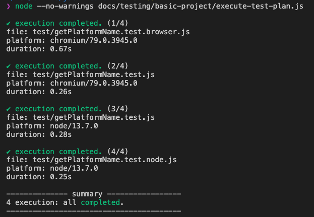

# core

Execute JavaScript on multiple environments for testing.

[](https://github.com/jsenv/jsenv-core/packages)
[](https://www.npmjs.com/package/@jsenv/core)
[](https://github.com/jsenv/jsenv-core/actions?workflow=ci)
[](https://codecov.io/gh/jsenv/jsenv-core)

# Table of contents

- [Presentation](#Presentation)
- [Installation](#Installation)
- [Documentation](#Documentation)

# Presentation

`@jsenv/core` is above all a testing framework. It executes your tests on a browser, nodejs or both and can generate the combined coverage from all executions.



You configure your test files and the associated execution on browsers or node.js in a file like the one below.

```js
import { executeTestPlan, launchNode, launchChromiumTab } from "@jsenv/core"

executeTestPlan({
  projectDirectoryUrl: new URL("./", import.meta.url),
  testPlan: {
    // executes files ending with test.js on chromium and node
    "./test/**/*.test.js": {
      browser: {
        launch: launchChromiumTab,
      },
      node: {
        launch: launchNode,
      },
    },
    // executes file ending with test.browser.js only on chromium
    "./test/**/*.test.browser.js": {
      browser: {
        launch: launchChromiumTab,
      },
    },
    // executes file ending with test.node.js only on node
    "./test/**/*.test.node.js": {
      node: {
        launch: launchNode,
      },
    },
  },
})
```

There is a detailed documentation about testing at [./docs/testing/readme.md](./docs/testing/readme.md). `@jsenv/core` can also bring you more as shown in the [Documentation](#Documentation) part.

# Installation

```console
npm install --save-dev @jsenv/core@11.0.2
```

`@jsenv/core` is tested on mac, linux and windows platforms. It supports Node.js 12.8.0 and 13.7.0, other versions are not supported.

# Documentation

`@jsenv/core` exports functions needed during the life of a typical JavaScript project. These functions are independant, you can use them according to each project requirements. Using every `@jsenv/core` functions results in a unified developer experience.

- execute test files on a browser and/or node.js.<br/>
  — see [./docs/testing/readme.md](./docs/testing/readme.md)

- explore files using a browser.<br/>
  — see [./docs/exploring/readme.md](./docs/exploring/readme.md)

- execute file on a browser or node.js.<br/>
  — see [./docs/executing/readme.md](./docs/executing/readme.md)

- bundle your package into a format compatible with browsers and/or node.js.<br/>
  — see [./docs/bundling/readme.md](./docs/bundling/readme.md)
