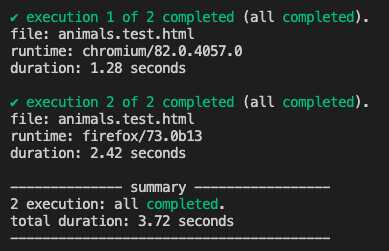

# jsenv

Tool to develop, test and build js projects.

[](https://www.npmjs.com/package/@jsenv/core)
[](https://github.com/jsenv/jsenv-core/actions?workflow=ci)
[](https://codecov.io/gh/jsenv/jsenv-core)

# Presentation

`@jsenv/core` was first created to write tests that could be executed in different browsers AND Node.js. In the end it became a tool covering the core needs of a JavaScript project:

- A development server
- A test runner to execute test files
- A builder/bundler to optimize files for production

Jsenv integrates naturally with standard html, css and js. It can be configured to work with TypeScript and React.

# Test runner overview

Let's assume you want to test `countDogs` exported by `animals.js` file.

```js
export const countDogs = (animals) => {
  return animals.filter((animal) => animal === "dog").length
}
```

1. Create `animals.test.html`

   ```html
   <!DOCTYPE html>
   <html>
     <head>
       <meta charset="utf8" />
       <link rel="icon" href="data:," />
     </head>
     <body>
       <script type="module">
         import { countDogs } from "./animals.js"

         const animals = ["dog", "dog", "cat", "cat", "cat"]
         const actual = countDogs(animals)
         const expected = 2
         if (actual !== expected) {
           throw new Error(`countDogs should return ${expected}, got ${actual}`)
         }
       </script>
     </body>
   </html>
   ```

2. Add `"@jsenv/core"` to your _devDependencies_

   ```console
   npm install --save-dev @jsenv/core
   ```

3. Create `execute_test_plan.mjs`

   ```js
   import { executeTestPlan, launchChromiumTab, launchFirefoxTab, launchNode } from "@jsenv/core"

   executeTestPlan({
     projectDirectoryUrl: new URL("./", import.meta.url),
     testPlan: {
       "./animals.test.html": {
         chromium: {
           launch: launchChromiumTab,
         },
         firefox: {
           launch: launchFirefoxTab,
         },
       },
     },
   })
   ```

4. Run `execute_test_plan.mjs` with Node.js

   ```console
   > node ./execute_test_plan.mjs
   ```

   

To read more about testing in jsenv, check [Testing with jsenv](./docs/testing/readme.md#Testing-with-jsenv).

# Dev server overview

You have an html file that you want to open in a browser on your machine.

```html
<!DOCTYPE html>
<html>
  <head>
    <meta charset="utf8" />
    <link rel="icon" href="data:," />
  </head>
  <body>
    <h1>Hello world!</h1>
  </body>
</html>
```

1. Add `"@jsenv/core"` to your _devDependencies_

   ```console
   npm install --save-dev @jsenv/core
   ```

2. Create `start_dev_server.mjs`

   ```js
   import { startExploring } from "@jsenv/core"

   startExploring({
     projectDirectoryUrl: new URL("./", import.meta.url),
     explorableConfig: {
       source: {
         "**/*.html": true,
       },
     },
     compileServerPort: 3456,
   })
   ```

3. Run `start_dev_server.mjs` with Node.js

   ```console
   > node ./start_dev_server.mjs
   server started at https://localhost:3456
   ```

4. Open a browser and naviguate to `https://localhost:3456`

   When you open `https://localhost:3456` in a browser, a page called jsenv exploring index is shown. It displays a list of links to your html files.

   

5. Click `main.html`

   Browser naviguates to `main.html` and execute the file. Hello world is displayed in the browser.

   

To read more about jsenv dev server, also called exploring server, check [Exploring server](./docs/exploring/readme.md#Exploring-presentation).

# Builder overview

Following the steps below turns an `index.html` into an optimized `dist/main.html`. Only the content of the html files will be shown. The content of other files such as `favicon.ico` is trivial.

```html
<!DOCTYPE html>
<html>
  <head>
    <title>Title</title>
    <meta charset="utf-8" />
    <link rel="icon" href="./favicon.ico" />
    <script type="importmap" src="./import_map.importmap"></script>
    <link rel="stylesheet" type="text/css" href="./main.css" />
  </head>

  <body>
    <script type="module" src="./main.js"></script>
  </body>
</html>
```

1. Add `"@jsenv/core"` to your _devDependencies_

   ```console
   npm install --save-dev @jsenv/core
   ```

2. Create `build.mjs`

   ```js
   import { buildProject } from "@jsenv/core"

   await buildProject({
     projectDirectoryUrl: new URL("./", import.meta.url),
     buildDirectoryRelativeUrl: "dist",
     enryPointMap: {
       "./index.html": "./main.html",
     },
     format: "esmodule",
     minify: false,
   })
   ```

3. Run `build.mjs` with Node.js

   ```console
   > node ./build.mjs
   ```

4. Open `dist/index.html`

   ```html
   <!DOCTYPE html>
   <html>
     <head>
       <title>Title</title>
       <meta charset="utf-8" />
       <link rel="icon" href="assets/favicon-5340s4789a.ico" />
       <script type="importmap" src="import-map-b237a334.importmap"></script>
       <link rel="stylesheet" type="text/css" href="assets/main-3b329ff0.css" />
     </head>

     <body>
       <script type="module" src="./main-f7379e10.js"></script>
     </body>
   </html>
   ```

Read more [building documentation](./docs/building/readme.md)

# Jsenv philosophy

Jsenv focuses on one thing: developer experience. Everything was carefully crafted to get explicit and coherent apis.

## Dispensable by default

Jsenv is **dispensable** by default. As long as your code is using only standards, you could remove jsenv from your project and still be able to run your code. You can double click your html file to open it inside your browser -> it works. Or if this is a Node.js file execute it directly using the `node` command.

Being dispensable by default highlights jsenv philosophy: no new concept to learn. It also means you can switch to an other tool easily as no part of your code is specific to jsenv.

## Explicitness over magic

Jsenv also don't like blackboxes. `@jsenv/core` functions always choose expliciteness over magic. It makes things much simpler to understand and follow both for jsenv and for you.

> One example of expliciteness over magic: You control and tell jsenv where is your project directory. Jsenv don't try to guess or assume where it is.

## Less context switching

Context switching happens when you are in context A and switch to context B. The more context A differ from context B, the harder it is to switch.

Some example where context switching occurs:

- switching from a regular file to a unit test file
- switching from a file written for web browsers to file written for Node.js

With jsenv context switching almost vanishes because:

- [exploring](#exploring) provides a unified experience regardless of the file being executed (unit test, web page, reduced test case, experimentation, ...)
- [testing](#testing) and [building](building) are both capable to handle files written for browsers and/or Node.js

Less context switching saves lot of energy making a project codebase faster to write and easier to maintain.

<!--
features below belong to some parts
importmap are mostly useful for tests and import aliases
dynamic import for build and production
top level await is already mentioned

we could have an other section exlaining that jsenv supports all this

-->
<details>
  <summary>Import maps</summary>

> This proposal allows control over what URLs get fetched by JavaScript import statements and import() expressions. This allows "bare import specifiers", such as import moment from "moment", to work.
>
> — Domenic Denicola in [WICG/import-maps](https://github.com/WICG/import-maps)

Jsenv supports import maps out of the box. The following html can be used with jsenv:

```html
<!DOCTYPE html>
<html>
  <head>
    <title>Title</title>
    <meta charset="utf-8" />
    <script type="importmap">
      {
        "imports": {
          "moment": "./node_modules/moment/index.js"
        }
      }
    </script>
  </head>

  <body>
    <script type="module">
      import moment from "moment"
      console.log(moment)
    </script>
  </body>
</html>
```

</details>

<details>
  <summary>Top level await</summary>

> Top-Level await has moved to stage 3, so the answer to your question How can I use async/await at the top level? is to just add await the call to main()
>
> — Taro in [How can I use async/await at the top level?](https://stackoverflow.com/a/56590390/2634179)

Jsenv supports top level await out of the box. Top level await allow jsenv to know when a file code is done executing. This is used to kill a file that is too long to execute and know when to collect code coverage.

</details>

<details>
  <summary>Dynamic import</summary>

> The lazy-loading capabilities enabled by dynamic import() can be quite powerful when applied correctly. For demonstration purposes, Addy modified an example Hacker News PWA that statically imported all its dependencies, including comments, on first load. The updated version uses dynamic import() to lazily load the comments, avoiding the load, parse, and compile cost until the user really needs them.
>
> — Mathias Bynens on [Dynamic import()](https://v8.dev/features/dynamic-import#dynamic)

Dynamic import are supported by jsenv. When building project using `buildProject`, dynamic import are turned into separate chunks.

</details>

<details>
  <summary>import.meta.url</summary>

> It's a proposal to add the ability for ES modules to figure out what their file name or full path is. This behaves similarly to \_\_dirname in Node which prints out the file path to the current module. According to caniuse, most browsers already support it (including the latest Chromium Edge)
>
> — Jake Deichert on [A Super Hacky Alternative to import.meta.url](https://jakedeichert.com/blog/2020/02/a-super-hacky-alternative-to-import-meta-url/)

Jsenv supports `import.meta.url`.

</details>

<details>
  <summary>Asset reference by url</summary>

A common pattern to reference an asset is to use an import statement. This import would actually return an url to the asset.

```js
import imageUrl from "./img.png"
```

As it's not standard, it doesn't work in the browser without transformation. However, `import.meta.url` does work in the browser.

```js
const imageUrl = new URL("./img.png", import.meta.url)
```

You can use both patterns to reference an asset but prefer the one relying on `import.meta.url`.

</details>

The list above is non exaustive, there is more like tree shaking, long term caching, service workers, ...

# Installation

```console
npm install --save-dev @jsenv/core
```

`@jsenv/core` is tested on Mac, Windows, Linux on Node.js 14.5.0. Other operating systems and Node.js versions are not tested.

# Configuration

Jsenv can execute standard JavaScript and be configured to run non-standard JavaScript.

Standard corresponds to [JavaScript Modules](https://developer.mozilla.org/en-US/docs/Web/JavaScript/Guide/Modules), destructuring, optional chaining and so on.

Non-standard corresponds to [CommonJS modules](https://code-trotter.com/web/understand-the-different-javascript-modules-formats/#commonjs-cjs), [JSX](https://reactjs.org/docs/introducing-jsx.html) or [TypeScript](https://www.typescriptlang.org).

> Keep in mind one of your dependency may use non-standard JavaScript. For instance react uses CommonJS modules.

## jsenv.config.js

We recommend to regroup configuration in a `jsenv.config.js` file at the root of your working directory.

To get a better idea see [jsenv.config.js](./jsenv.config.js). The file can be imported and passed using the spread operator. This technic helps to see jsenv custom configuration quickly and share it between files.

<details>
  <summary>Example of jsenv config passed using spread operator</summary>


— See [script/test/test.js](https://github.com/jsenv/jsenv-core/blob/e44e362241e8e2142010322cb4552983b3bc9744/script/test/test.js#L2)

</details>

That being said it's only a recommendation. There is nothing enforcing or checking the presence of `jsenv.config.js`.

## CommonJS

CommonJS module format rely on `module.exports` and `require`. It was invented by Node.js and is not standard JavaScript. If your code or one of your dependency uses it, it requires some configuration.

<details>
  <summary><code>jsenv.config.js</code> to use code written in CommonJS</summary>

```js
import { jsenvBabelPluginMap, convertCommonJsWithRollup } from "@jsenv/core"

export const convertMap = {
  "./node_modules/whatever/index.js": convertCommonJsWithRollup,
}
```

`jsenv.config.js` above makes jsenv compatible with a package named `whatever` that would be written in CommonJS.

</details>

## React

React is written in CommonJS and comes with JSX. If you use them it requires some configuration.

<details>
  <summary><code>jsenv.config.js</code> for react and jsx</summary>

```js
import { createRequire } from "module"
import { jsenvBabelPluginMap, convertCommonJsWithRollup } from "@jsenv/core"

const require = createRequire(import.meta.url)
const transformReactJSX = require("@babel/plugin-transform-react-jsx")

export const babelPluginMap = {
  ...jsenvBabelPluginMap,
  "transform-react-jsx": [
    transformReactJSX,
    { pragma: "React.createElement", pragmaFrag: "React.Fragment" },
  ],
}

export const convertMap = {
  "./node_modules/react/index.js": convertCommonJsWithRollup,
  "./node_modules/react-dom/index.js": (options) => {
    return convertCommonJsWithRollup({ ...options, external: ["react"] })
  },
}
```

You must also add an importmap file in your html to remap react imports.

```diff
+ <script type="importmap" src="./project.importmap"></script>
```

`project.importmap`

```json
{
  "imports": {
    "react": "./node_modules/react/index.js",
    "react-dom": "./node_modules/react-dom/index.js"
  }
}
```

See also

- [babelPluginMap](./docs/shared-parameters.md#babelPluginMap)
- [convertMap](./docs/shared-parameters.md#convertMap)
- [transform-react-jsx on babel](https://babeljs.io/docs/en/next/babel-plugin-transform-react-jsx.html)
- [importMap spec](https://github.com/WICG/import-maps#import-maps)

</details>

## TypeScript

TypeScript needs some configuration if you use it.

<details>
  <summary><code>jsenv.config.js</code> for TypeScript</summary>

```js
import { createRequire } from "module"
import { jsenvBabelPluginMap } from "@jsenv/core"

const require = createRequire(import.meta.url)
const transformTypeScript = require("@babel/plugin-transform-typescript")

export const babelPluginMap = {
  ...jsenvBabelPluginMap,
  "transform-typescript": [transformTypeScript, { allowNamespaces: true }],
}

export const importDefaultExtension = true
```

See also

- [babelPluginMap](./docs/shared-parameters.md#babelPluginMap)
- [importDefaultExtension](./docs/shared-parameters.md#importDefaultExtension)
- [transform-typescript on babel](https://babeljs.io/docs/en/next/babel-plugin-transform-typescript.html)

</details>

# About

## When to use it

Amongst other use cases, the ease of use and flexibility of jsenv makes it a great tool to start and learn web development.

Firstly because jsenv is a tool that was built to run raw js, html and css. It starts from the **simplest form of coding**. If a browser can run your code, so can jsenv without configuration or things to learn. There is no magic that will bite you right away or later. Jsenv can be configured to add react, typescript, whatever you need, later, on demand.

Secondly because jsenv is compatible with the latest standards. Even some that are not yet mature in the js ecosystem, such as import maps. This will makes you at ease with technologies that will be part of the ecosystem once you are confortable with coding.

To sum up, jsenv focuses on simplicity and flexibility making it a perfect candidate to learn the ecosystem gradually. In the end, you might even consider sticking to vanilla js if that makes sense for you and your project.

## Main dependencies

An overview of the main dependencies used by `@jsenv/core`.

| Dependency                                            | How it is used by jsenv                     |
| ----------------------------------------------------- | ------------------------------------------- |
| [systemjs](https://github.com/systemjs/systemjs)      | "Polyfill" js modules, import maps and more |
| [playwright](https://github.com/microsoft/playwright) | Launch Chromium, Firefox and WebKit         |
| [istanbul](https://github.com/gotwarlost/istanbul)    | Collect and generate code coverage          |
| [rollup](https://github.com/rollup/rollup)            | Tree shaking when building                  |
| [babel](https://github.com/babel/babel)               | Parse and transform js                      |
| [parse5](https://github.com/inikulin/parse5)          | Parse and transform html                    |
| [postCSS](https://github.com/postcss/postcss)         | Parse and transform css                     |

## Name

The name `jsenv` stands for JavaScript environments. This is because the original purpose of `jsenv` was to bring closer two JavaScript runtimes: web browsers and Node.js. This aspect of `jsenv` is not highlighted in the documentation but it exists.

Maybe `jsenv` should be written `JSEnv`? That makes typing the name too complex:

1. Hold `shift` on keyboard
2. While holding `shift`, type `JSE`
3. Release `shift`
4. Finally, type `nv`.

No one should have to do that, the prefered syntax is `jsenv`.

## Logo

The logo is composed by the name at the center and two circles orbiting around it. One of the circle is web browsers, the other is Node.js. It represents the two JavaScript environments supported by jsenv.


<details>
  <summary>Jsenv logo origin explained</summary>


> **Warning**: This is a joke

</details>

# See also

- [@jsenv/template-pwa](https://github.com/jsenv/jsenv-template-pwa): GitHub repository template for a progressive web application.
- [@jsenv/template-node-package](https://github.com/jsenv/jsenv-template-node-package): GitHub repository template for a node package.
- [@jsenv/assert](https://github.com/jsenv/jsenv-assert): Test anything using one assertion. This library can be used on browsers and Node.js so feel free to reuse file structure to create your own library meant to run in browsers AND Node.js.
- [@jsenv/sass](./packages/jsenv-sass): Add support for .scss and .sass in jsenv.
- [@jsenv/vue](./packages/jsenv-vue): Add support for .vue in jsenv.
- [Jsenv compile server](./docs/jsenv-compile-server.md): Document how jsenv works internally to compile on demand with a filesystem cache.
- [I am too lazy for a test framework](https://medium.com/@DamienMaillard/i-am-too-lazy-for-a-test-framework-ca08d216ee05): Article presenting a straightforward testing experience and proposing jsenv to obtain it.
