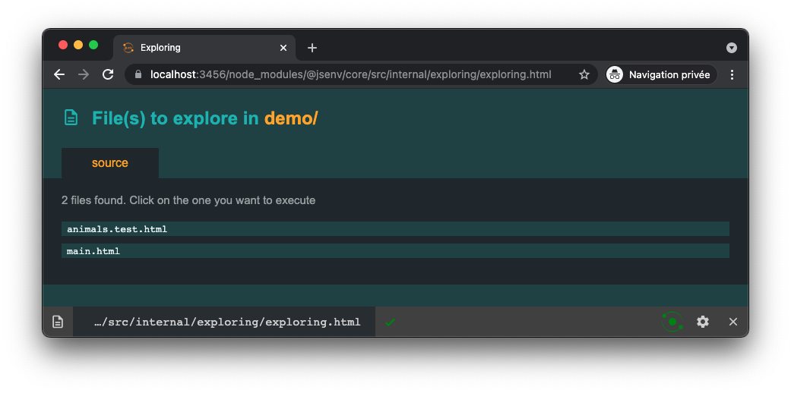

# jsenv [](https://www.npmjs.com/package/@jsenv/core) [](https://github.com/jsenv/jsenv-core/actions?workflow=main) [](https://codecov.io/gh/jsenv/jsenv-core)

_@jsenv/core_ is a quick start pack to launch a js project. It provides what you need from the beginning: develoment, testing and building all in one.

Jsenv **integrates naturally with standard** HTML, CSS and JS: you don't have to pick a JavaScript framework.

# Overview

This section demos 3 things jsenv provides:

1. A test runner
2. A dev server
3. A build script

Don't be fooled by the apparent simplicity of the following demos, jsenv can be used on more complex scenarios as well.

## Test runner overview

Let's assume you want to test `countDogs` exported by _animals.js_ file.

```js
export const countDogs = (animals) => {
  return animals.filter((animal) => animal === "dog").length
}
```

1 - Create _animals.test.html_

```html
<!DOCTYPE html>
<html>
  <head>
    <meta charset="utf8" />
    <link rel="icon" href="data:," />
  </head>
  <body>
    <script type="module">
      import { countDogs } from "./animals.js"

      const animals = ["dog", "dog", "cat", "cat", "cat"]
      const actual = countDogs(animals)
      const expected = 2
      if (actual !== expected) {
        throw new Error(`countDogs should return ${expected}, got ${actual}`)
      }
    </script>
  </body>
</html>
```

2 - Create _test.mjs_

```js
import {
  executeTestPlan,
  chromiumTabRuntime,
  firefoxTabRuntime,
} from "@jsenv/core"

await executeTestPlan({
  projectDirectoryUrl: new URL("./", import.meta.url),
  testPlan: {
    "./animals.test.html": {
      chromium: {
        runtime: chromiumTabRuntime,
      },
      firefox: {
        runtime: firefoxTabRuntime,
      },
    },
  },
})
```

3 - Add _@jsenv/core_ and _playwright_

```console
npm install --save-dev @jsenv/core
npm install --save-dev playwright
npx playwright install-deps
npx playwright install
```

4 - Run _test.mjs_ with Node.js

```console
> node ./test.mjs

✔ execution 1 of 2 completed (all completed)
file: animals.test.html
runtime: chromium/97.0.4666.0
duration: 0.45 seconds

✔ execution 2 of 2 completed (all completed)
file: animals.test.html
runtime: firefox/93.0
duration: 0.81 seconds

-------------- summary -----------------
2 executions: all completed
total duration: 1.2 seconds
----------------------------------------
```

To read more about testing in jsenv, check [jsenv test runner documentation](./docs/testing/readme.md#jsenv-test-runner).

## Dev server overview

You want to execute the following _main.html_ file in a browser.

```html
<!DOCTYPE html>
<html>
  <head>
    <meta charset="utf8" />
    <link rel="icon" href="data:," />
  </head>
  <body>
    <h1>Hello world!</h1>
  </body>
</html>
```

1 - Add _@jsenv/core_ to your _devDependencies_

```console
npm install --save-dev @jsenv/core
```

2 - Create _start_dev_server.mjs_

```js
import { startDevServer } from "@jsenv/core"

await startDevServer({
  projectDirectoryUrl: new URL("./", import.meta.url),
  explorableConfig: {
    source: {
      "./*.html": true,
    },
  },
  port: 3456,
})
```

3 - Run _start_dev_server.mjs_ with Node.js

```console
> node ./start_dev_server.mjs

server started at http://localhost:3456
```

4 - Open a browser and navigate to `http://localhost:3456`

When you open `http://localhost:3456` in a browser, a page called jsenv exploring index is shown. It displays a list of links to your html files.



5 - Click _main.html_

Browser navigates to _main.html_ and execute the file. Hello world is displayed in the browser.


To read more about jsenv dev server, check [jsenv dev server documentation](./docs/dev_server/readme.md#jsenv-dev-server).

## Build overview

Following the steps below turns a `main.html` into an optimized `dist/main.prod.html`.
Only the content of html files is shown below because the content of non-html files is trivial.

```html
<!DOCTYPE html>
<html>
  <head>
    <title>Title</title>
    <meta charset="utf-8" />
    <link rel="modulepreload" href="./main.js" />
    <link rel="icon" href="./favicon.ico" />
    <script type="importmap" src="./import_map.importmap"></script>
    <link rel="stylesheet" type="text/css" href="./main.css" />
  </head>

  <body>
    <script type="module" src="./main.js"></script>
  </body>
</html>
```

1 - Add _@jsenv/core_ to your _devDependencies_

```console
npm install --save-dev @jsenv/core
```

2 - Create _build.mjs_

```js
import { buildProject } from "@jsenv/core"

await buildProject({
  projectDirectoryUrl: new URL("./", import.meta.url),
  buildDirectoryRelativeUrl: "dist",
  entryPoints: {
    "./main.html": "main.prod.html",
  },
  format: "esmodule",
  minify: true,
})
```

3 - Run _build.mjs_ with Node.js

```console
> node ./build.mjs

building ./main.html...
--- files in the build: 5 ---
dist/assets/favicon-25e95a00.png (6.67 KB)
dist/assets/main-feec3a1b.css (62 B)
dist/main-63252261.js (50 Kb)
dist/main.prod.html (392 B)
dist/project-d2192ffe.importmap (29 B)
--- sourcemap files in the build: 2 ---
dist/assets/main-feec3a1b.css.map (198 B)
dist/main-63252261.js.map (55Kb B)
------- build summary -------
project files: 27 (70.38 KB)
build files: 5 (45.2 KB)
build duration: 1.85 seconds
------------------------------
✔ build end
```

4 - Open _dist/main.prod.html_

```html
<!DOCTYPE html>
<html>
  <head>
    <title>Title</title>
    <meta charset="utf-8" />
    <link rel="modulepreload" href="main-f7379e10.js" />
    <link rel="icon" href="assets/favicon-5340s4789a.ico" />
    <script type="importmap" src="import-map-b237a334.importmap"></script>
    <link rel="stylesheet" type="text/css" href="assets/main-3b329ff0.css" />
  </head>

  <body>
    <script type="module" src="./main-f7379e10.js"></script>
  </body>
</html>
```

To read more about jsenv build tool, check [jsenv build documentation](./docs/building/readme.md#jsenv-build).

# About

Jsenv was first created to write tests that could be executed in different runtimes. It has naturally evolved to cover the core needs of a JavaScript project:

- A development server
- A test runner to execute test files
- A build tool to optimize files for production

Jsenv relies on **standard web features**. Each standard listed below is potentially supported natively by the browser. When browser supports all of them, jsenv will use source files without modification. Otherwise, the files are compiled to be executable in the browser.

- `<script type="module">`
- `<script type="importmap">`
- top level await
- import.meta.url
- dynamic imports
- import assertions

## When to use it?

Amongst other use cases, the ease of use and flexibility of jsenv makes it a great tool to start and learn web development.

First because jsenv is a tool that was built to run raw js, html and css. It starts from the **simplest form of coding** in JavaScript. If a browser can run your code, so can jsenv without configuration or things to learn. There is no magic that will bite you right away or later. Jsenv can be configured to add more stuff later, on demand.

Second because jsenv is compatible with the latest standards. Even some that are not yet mature in the js ecosystem, such as import maps. This will makes you at ease with technologies that will be part of the ecosystem once you are confortable with coding.

To sum up, jsenv focuses on simplicity and flexibility making it a perfect candidate to learn the ecosystem gradually.

## Main dependencies

An overview of the main dependencies used by _@jsenv/core_.

| Dependency                                            | How it is used by jsenv                     |
| ----------------------------------------------------- | ------------------------------------------- |
| [systemjs](https://github.com/systemjs/systemjs)      | "Polyfill" js modules, import maps and more |
| [playwright](https://github.com/microsoft/playwright) | Launch Chromium, Firefox and WebKit         |
| [istanbul](https://github.com/gotwarlost/istanbul)    | Collect and generate code coverage          |
| [rollup](https://github.com/rollup/rollup)            | Tree shaking when building                  |
| [babel](https://github.com/babel/babel)               | Parse and transform js                      |
| [parse5](https://github.com/inikulin/parse5)          | Parse and transform html                    |
| [postCSS](https://github.com/postcss/postcss)         | Parse and transform css                     |

## Name

The name "jsenv" stands for JavaScript environments. This is because the original purpose of jsenv was to bring closer two JavaScript runtimes: web browsers and Node.js.

Maybe "jsenv" should be written "JSEnv"? That makes typing the name too complex:

1. Hold `shift` on keyboard
2. While holding `shift`, type `JSE`
3. Release `shift`
4. Finally, type `nv`.

No one wants to do that: the prefered syntax is "jsenv".

## Logo

The logo is composed by the name at the center and two circles orbiting around it. One of the circle is web browsers, the other is Node.js. It represents the two JavaScript environments supported by jsenv.


<details>
  <summary>Jsenv logo origin explained</summary>


> This is a joke

</details>

# Installation

```console
npm install --save-dev @jsenv/core
```

_@jsenv/core_ is tested on Mac, Windows, Linux on Node.js 16.13.0. Other operating systems and Node.js versions are not tested.

# Configuration

Jsenv configuration is done in [jsenv.config.mjs](#jsenvconfigmjs) and [babel.config.cjs](#babelconfigcjs).

## jsenv.config.mjs

We recommend to put configuration in a top level file named _jsenv.config.mjs_ like the one below:

```js
/*
 * This file exports configuration reused by jsenv scripts such as
 *
 * script/test/test.mjs
 * script/build/build.mjs
 *
 * Read more at https://github.com/jsenv/jsenv-core#jsenvconfigmjs
 */

export const projectDirectoryUrl = new URL("./", import.meta.url)
```

This file helps to see jsenv configuration quickly and share it between files. That being said you are free to organize your configuration as you want.

## babel.config.cjs

When code needs to be transformed, the project must contain a [babel config file](https://babeljs.io/docs/en/config-files).

It's recommended to use the following _babel.config.cjs_

```js
/*
 * This file configure the list of babel plugins enabled
 * in this codebase
 *
 * Read more at https://github.com/jsenv/jsenv-core/tree/master/packages/jsenv-babel-preset
 */

module.exports = {
  presets: ["@jsenv/babel-preset"],
}
```

# See also

| Link                                                                                 | Description                                                               |
| ------------------------------------------------------------------------------------ | ------------------------------------------------------------------------- |
| [Browser support](./docs/config/browser_support.md)                                  | Document how to configure browser support                                 |
| [Web workers](./docs/config/web_workers.md)                                          | Document how to use web workers                                           |
| [React](./docs/config/react.md)                                                      | Document how to enable react/preact and JSX                               |
| [CommonJS modules](./docs/config/commonjs.md)                                        | Document how to use code written in CommonJS                              |
| [TypeScript (Experimental)](./docs/config/typescript.md)                             | Document how to enable TypeScript                                         |
| [@jsenv/template-pwa](https://github.com/jsenv/jsenv-template-pwa)                   | GitHub repository template for a progressive web application              |
| [@jsenv/template-node-package](https://github.com/jsenv/jsenv-template-node-package) | GitHub repository template for a node package                             |
| [@jsenv/assert](https://github.com/jsenv/assert)                                     | NPM package to write assertions                                           |
| [I am too lazy for a test framework](shorturl.at/rFY39)                              | Article presenting a straightforward testing experience                   |
| [Jsenv compile server](./docs/jsenv-compile-server.md)                               | Documentation about jsenv progressive compilation with a filesystem cache |
