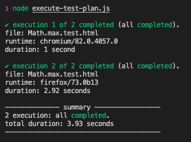
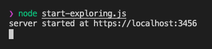
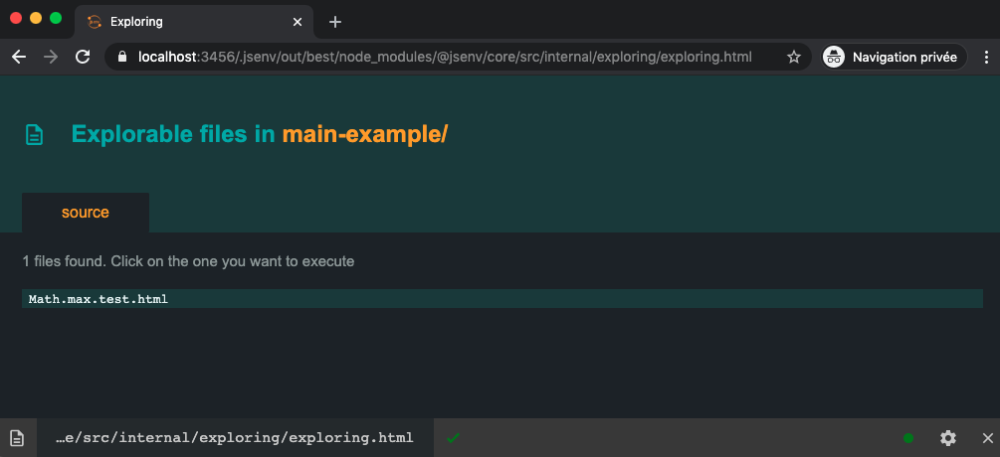
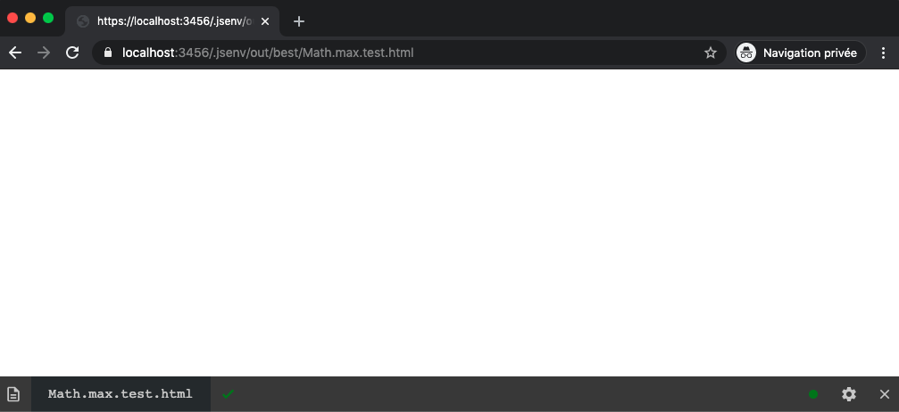
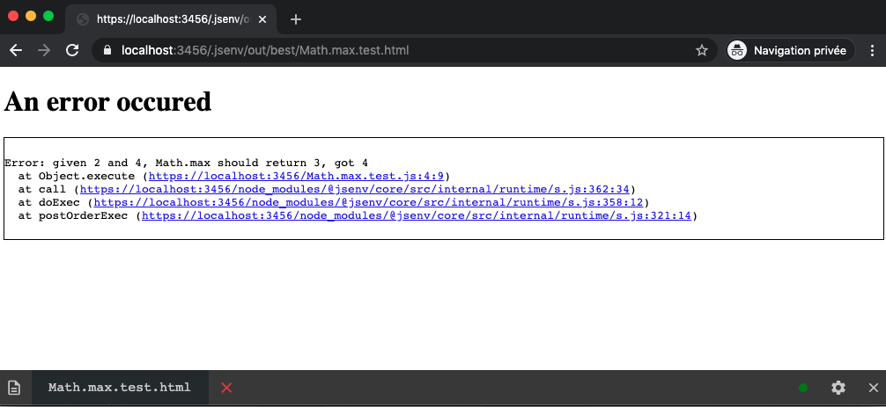

# core

Execute JavaScript on multiple environments for testing.

[](https://github.com/jsenv/jsenv-core/packages)
[](https://www.npmjs.com/package/@jsenv/core)
[](https://github.com/jsenv/jsenv-core/actions?workflow=ci)
[](https://codecov.io/gh/jsenv/jsenv-core)

# Table of contents

- [Presentation](#Presentation)
- [Example](#Example)
  - [Executing tests](#Executing-tests)
  - [Writing tests](#Writing-tests)
- [Installation](#Installation)
- [Configuration](#Configuration)
  - [jsenv.config.js](#jsenvconfigjs)
  - [CommonJS](#CommonJS)
  - [React](#React)
  - [TypeScript](#TypeScript)
- [Advanced features](#Advanced-features)

# Presentation

`@jsenv/core` is a test runner. It focuses on executing many JavaSripts files in parallel and report how it goes.



It's main strength are:

- Can execute file in browsers (chromium, firefox, webkit)
- Can execute file in Node.js
- Easy to debug single test file
- Can be configured to run jsx, typescript and more
- Can generate coverage from all file executions
- Rely on top level await to test asynchronous code

# Example

For the example let's start with one test file.

> In reality you would never test `Math.max`, the code below is testing it to show an example unrelated to a specific codebase.

`Math.max.test.js`

```js
const actual = Math.max(2, 4)
const expected = 4
if (actual !== expected) {
  throw new Error(`Math.max(2, 4) should return ${expected}, got ${actual}`)
}
```

`Math.max.test.html`

```html
<!DOCTYPE html>
<html>
  <head>
    <meta charset="utf8" />
    <link rel="icon" href="data:," />
  </head>
  <body>
    <script type="module" src="./Math.max.test.js"></script>
  </body>
</html>
```

## Executing tests

Let's create a script that will execute `Math.max.test.html` in chromium and firefox.

`execute-test-plan.js`

```js
import { executeTestPlan, launchChromiumTab, launchFirefoxTab } from "@jsenv/core"

executeTestPlan({
  projectDirectoryUrl: new URL("./", import.meta.url),
  testPlan: {
    "./**/*.test.html": {
      chromium: {
        launch: launchChromiumTab,
      },
      firefox: {
        launch: launchFirefoxTab,
      },
    },
  },
})
```

```console
node ./execute-test-plan.js
```


As shown by the logs jsenv has launched chromium and firefox and executed `Math.max.test.html`. Check [testing](./docs/testing/readme.md) documentation for more information.

## Writing tests

jsenv is more than a test runner, it also provide a dev environment to execute and or debug files one by one. It is very useful to write tests, either for the first time or when a test needs to be updated.

Let's create a script starting this environment.

`start-exploring.js`

```js
import { startExploring } from "@jsenv/core"

startExploring({
  projectDirectoryUrl: new URL("./", import.meta.url),
  explorableConfig: {
    source: {
      "**/*.html": true,
    },
  },
  compileServerPort: 3456,
  livereloading: true,
})
```

```console
node ./start-exploring.js
```



When you open that url in a browser you will a page called see jsenv exploring index



If you click `Math.max.test.html`, your file will be executed in the browser



Then if you update `Math.max.test.js` to make it fail

```diff
- const expected = 4
+ const expected = 3
```

The browser will livereload the page and display the failure.



There is also a system notification displayed.


If you revert you changes

```diff
- const expected = 3
+ const expected = 4
```

Browser livereloads again and you can see error is gone.


There is also a system notification displayed.


Check [exploring](./docs/exploring/readme.md) documentation for more information.

# Installation

```console
npm install --save-dev @jsenv/core
```

`@jsenv/core` is tested on Mac, Windows, Linux on Node.js 14.5.0. Other operating systems and Node.js versions are not tested.

> Jsenv should be compatible with node 12.8 and above but it's no longer guaranteed.

# Configuration

Jsenv can execute standard JavaScript without additional configuration. It means Jsenv support [JavaScript Modules](https://developer.mozilla.org/en-US/docs/Web/JavaScript/Guide/Modules), destructuring, optional chaining and so on by default.

Jsenv can be configured to be compatible with non-standard JavaScript. For instance using [CommonJS modules](https://code-trotter.com/web/understand-the-different-javascript-modules-formats/#commonjs-cjs), [JSX](https://reactjs.org/docs/introducing-jsx.html) or [TypeScript](https://www.typescriptlang.org).

> Keep in mind one of your dependency may use non-standard JavaScript.

## jsenv.config.js

We recommend to regroup configuration in a `jsenv.config.js` file at the root of your working directory.

To get a better idea see [jsenv.config.js](./jsenv.config.js). The file is imported by [script/test/test.js](https://github.com/jsenv/jsenv-core/blob/e44e362241e8e2142010322cb4552983b3bc9744/script/test/test.js#L2) and configuration is passed [using spread operator](https://github.com/jsenv/jsenv-core/blob/e44e362241e8e2142010322cb4552983b3bc9744/script/test/test.js#L5). This technic helps to see jsenv custom configuration quickly and share it between files.

That being said it's only a recommendation. There is nothing enforcing or checking the presence of `jsenv.config.js`.

## CommonJS

CommonJS module format is not standard JavaScript. Using it requires some configuration. The following `jsenv.config.js` makes Jsenv compatible with a package written in CommonJS (`module.exports` and `require`).

```js
import { jsenvBabelPluginMap, convertCommonJsWithRollup } from "@jsenv/core"

export const convertMap = {
  "./node_modules/whatever/index.js": convertCommonJsWithRollup,
}
```

## React

React is written in CommonJS and comes with JSX. If you use them it requires some configuration. The following `jsenv.config.js` enables react and JSX.

```js
import { createRequire } from "module"
import { jsenvBabelPluginMap, convertCommonJsWithRollup } from "@jsenv/core"

const require = createRequire(import.meta.url)
const transformReactJSX = require("@babel/plugin-transform-react-jsx")

export const babelPluginMap = {
  ...jsenvBabelPluginMap,
  "transform-react-jsx": [
    transformReactJSX,
    { pragma: "React.createElement", pragmaFrag: "React.Fragment" },
  ],
}

export const convertMap = {
  "./node_modules/react/index.js": convertCommonJsWithRollup,
  "./node_modules/react-dom/index.js": (options) => {
    return convertCommonJsWithRollup({ ...options, external: ["react"] })
  },
}
```

See also

- [babelPluginMap](./docs/shared-parameters.md#babelPluginMap)
- [convertMap](./docs/shared-parameters.md#convertMap)
- [transform-react-jsx on babel](https://babeljs.io/docs/en/next/babel-plugin-transform-react-jsx.html)

## TypeScript

TypeScript is a subset of JavaScript, it requires some configuration if you use it. The following `jsenv.config.js` enable TypeScript.

```js
import { createRequire } from "module"
import { jsenvBabelPluginMap } from "@jsenv/core"

const require = createRequire(import.meta.url)
const transformTypeScript = require("@babel/plugin-transform-typescript")

export const babelPluginMap = {
  ...jsenvBabelPluginMap,
  "transform-typescript": [transformTypeScript, { allowNamespaces: true }],
}
```

See also

- [babelPluginMap](./docs/shared-parameters.md#babelPluginMap)
- [transform-typescript on babel](https://babeljs.io/docs/en/next/babel-plugin-transform-typescript.html)

# Advanced usage

`@jsenv/core` can execute standard JavaScript and be configured to run non-standard JavaScript. This can be reused for more than executing test files:

- [Exploring](./docs/exploring/readme.md):
  Start a development server to execute any file, comes with livereloading without configuration.

- [Executing](./docs/executing/readme.md):
  Execute one JavaScript file in a browser or Node.js, can be used to debug within VS Code.

- [Bundling](./docs/bundling/readme.md):
  Generate bundles compatible with browsers and Node.js.
