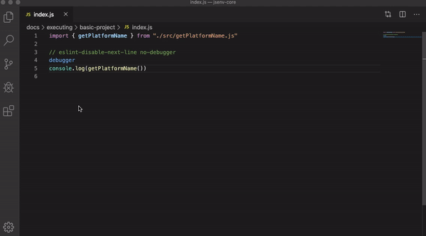

# core

[](https://github.com/jsenv/jsenv-core/packages)
[](https://www.npmjs.com/package/@jsenv/core)
[](https://github.com/jsenv/jsenv-core/actions?workflow=ci)
[](https://codecov.io/gh/jsenv/jsenv-core)

Write and maintain your Javascript projects.

# Table of contents

- [Presentation](#Presentation)
- [Example](#Example)
- [Usage](#Usage)
- [Installation](#Installation)

## Presentation

`@jsenv/core` exports functions needed during the life of a typical JavaScript project. These functions are independant so that you can use them according to each project requirements. Using every `@jsenv/core` functions results in a unified developer experience.

`jsenv-core` github repository corresponds to `@jsenv/core` package published on github and npm package registries.

## Example

The examples below are a subset of what `@jsenv/core` does.<br />
These examples can be reproduced on your machine by following the documentation in the next part: [Usage](#Usage)

> Example uses gif because github mardown does not supports video.
> Video are better for documentation because they don't autoplay and can be paused.
> You can find the original videos in [docs/example-asset/](./docs/example-asset)

### Multi platform test executions


### Debug file execution in chrome


### Debug file execution in node.js



## Usage

This part lists features provided by `@jsenv/core`. Each of them are independent and completes each other.

- explore files using a browser.<br/>
  — see [./docs/exploring/readme.md](./docs/exploring/readme.md)

- execute test files on a browser and/or node.js.<br/>
  — see [./docs/testing/readme.md](./docs/testing/readme.md)

- execute file on a browser or node.js.<br/>
  — see [./docs/executing/readme.md](./docs/executing/readme.md)

- bundle your package into a format compatible with browsers and/or node.js.<br/>
  — see [./docs/bundling/readme.md](./docs/bundling/readme.md)

The above could be achieved using babel, systemjs and rollup separately. jsenv makes them work together.

## Installation

If you never installed a jsenv package, read [Installing a jsenv package](./docs/installing-jsenv-package.md) before going further.

This documentation is up-to-date with a specific version so prefer any of the following commands

```console
npm install --save-dev @jsenv/core@10.4.0
```

```console
yarn add --dev @jsenv/core@10.4.0
```
