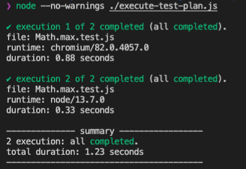

# core

Execute JavaScript on multiple environments for testing.

[](https://github.com/jsenv/jsenv-core/packages)
[](https://www.npmjs.com/package/@jsenv/core)
[](https://github.com/jsenv/jsenv-core/actions?workflow=ci)
[](https://codecov.io/gh/jsenv/jsenv-core)

# Table of contents

- [Presentation](#Presentation)
- [Installation](#Installation)
- [API](#API)
- [Configuration](#Configuration)
  - [jsenv.config.js](#jsenv.config.js)
  - [React](#React)
  - [TypeScript](#TypeScript)

# Presentation

`@jsenv/core` is above all a testing framework. It executes your tests on a browser, nodejs or both and can generate the combined coverage from all executions.

> In reality you would never test `Math.max`, the code below is testing it to show an example unrelated to a specific codebase.

`Math.max.test.js`

```js
const actual = Math.max(2, 4)
const expected = 4
if (actual !== expected) {
  throw new Error(`Math.max(2, 4) should return ${expected}, got ${actual}`)
}
```

`execute-test-plan.js`

```js
import { executeTestPlan, launchNode, launchChromiumTab } from "@jsenv/core"

executeTestPlan({
  projectDirectoryUrl: new URL("./", import.meta.url),
  testPlan: {
    "./**/*.test.js": {
      chromium: {
        launch: launchChromiumTab,
      },
      node: {
        launch: launchNode,
      },
    },
  },
})
```



There is a detailed documentation about testing at [./docs/testing/readme.md](./docs/testing/readme.md). `@jsenv/core` can also bring you more as shown in the [API](#API) part.

# Installation

```console
npm install --save-dev @jsenv/core
```

`@jsenv/core` is tested on Mac, Windows, Linux on Node.js 13.7.0 and 12.8.0. Other operating systems and Node.js versions are not tested.

# API

`@jsenv/core` exports functions needed during the life of a typical JavaScript project. These functions are independant, you can use them according to each project requirements. Using every `@jsenv/core` functions results in a unified developer experience.

- execute test files on a browser and/or node.js.<br/>
  — see [./docs/testing/readme.md](./docs/testing/readme.md)

- explore files using a browser.<br/>
  — see [./docs/exploring/readme.md](./docs/exploring/readme.md)

- execute file on a browser or node.js.<br/>
  — see [./docs/executing/readme.md](./docs/executing/readme.md)

- bundle your package into a format compatible with browsers and/or node.js.<br/>
  — see [./docs/bundling/readme.md](./docs/bundling/readme.md)

# Configuration

Jsenv can execute standard JavaScript without additional configuration. It means Jsenv support JavaScript Modules, destructuring, optional chaining and so on by default.

Jsenv can be configured to understand JavaScript that derivates from standards. For instance you need some configuration when some files or some dependency files uses CommonJS format, JSX syntax or TypeScript syntax.

— see [JavaScript Modules on MDN](https://developer.mozilla.org/en-US/docs/Web/JavaScript/Guide/Modules)<br/>
— see [JSX Introduction on React website](https://reactjs.org/docs/introducing-jsx.html)<br/>
— see [TypeScript website](https://www.typescriptlang.org)

## jsenv.config.js

We recommend to put your configuration in a `jsenv.config.js` file at the root of your repository.

To get a better idea check jsenv configuration file: [./jsenv.config.js](./jsenv.config.js). This file is imported by jsenv scripts such as [./script/test/test.js](./script/test/test.js) or [./script/generate-commonjs-bundle/generate-commonjs-bundle.js](./script/generate-commonjs-bundle/generate-commonjs-bundle.js).

This pattern is used by all jsenv packages and is a delight to work with. That being said it's only a recommended pattern, you can organize jsenv configuration and your scripts files the way you want.

## React

React is written in CommonJS and JSX is not standard JavaScript. If you use them it requires some configuration. The following `jsenv.config.js` enables react and JSX.

```js
import { createRequire } from "module"
import { jsenvBabelPluginMap, convertCommonJsWithRollup } from "@jsenv/core"

const require = createRequire(import.meta.url)
const transformReactJSX = require("@babel/plugin-transform-react-jsx")

export const babelPluginMap = {
  ...jsenvBabelPluginMap,
  // enable JSX syntax (you can configure the babel plugin too)
  "transform-react-jsx": [
    transformReactJSX,
    { pragma: "React.createElement", pragmaFrag: "React.Fragment" },
  ],
}

export const convertMap = {
  // converts react into JavaScript Modules format
  "./node_modules/react/index.js": convertCommonJsWithRollup,
  // converts react-dom into JavaScript Modules format
  "./node_modules/react-dom/index.js": (options) => {
    return convertCommonJsWithRollup({ ...options, external: ["react"] })
  },
}
```

## TypeScript

TypeScript is a subset of JavaScript, it requires some configuration if you use it. The following `jsenv.config.js` enables TypeScript.

```js
import { createRequire } from "module"
import { jsenvBabelPluginMap } from "@jsenv/core"

const require = createRequire(import.meta.url)
const syntaxTypeScript = require("@babel/plugin-syntax-typescript")

export const babelPluginMap = {
  ...jsenvBabelPluginMap,
  // enable TypeScript syntax
  "syntax-typescript": [syntaxTypeScript],
}
```
