# babel_helper_shared.md

## 0_js_module

```js
build({
  ...testParams,
  runtimeCompat: { chrome: "89" },
})
```

### 1/4 logs


### 2/4 write 4 files into "./dist/"

## js/a.js
```js
const getResponse = () => {
  return [42];
};
const [answer] = getResponse();

console.log({
  ...{ answer },
});

const a = "a";

export { a };

```

## js/b.js
```js
const getResponse = () => {
  return [42];
};
const [answer] = getResponse();

console.log({
  ...{ answer },
});

const b = "b";

export { b };

```

## js/main.js
```js
Promise.all([import(__v__("/js/a.js")), import(__v__("/js/b.js"))]).then(([{ a }, { b }]) => {
  window.resolveResultPromise({
    a,
    b,
  });
});

```

## main.html

```
<!DOCTYPE html>
<html>
  <head>
    <title>Title</title>
    <meta charset="utf8">
    <link rel="icon" href="data:,">
    <script>
      ;(function() {
        var __versionMappings__ = {
          "/js/a.js": "/js/a.js?v=7d423f40",
          "/js/b.js": "/js/b.js?v=0b78146b"
        };
        window.__v__ = function (specifier) {
          return __versionMappings__[specifier] || specifier
        };
      })();
    </script>
  </head>
  <body>
    <script>
```
see [main.html](./0_js_module/dist/main.html) for more

### 3/4 logs



### 4/4 resolve

```js
{
  "buildInlineContents": {
    "main.html@L9C5-L13C14.js": "\n      window.resultPromise = new Promise((resolve) => {\n        window.resolveResultPromise = resolve;\n      });\n    "
  },
  "buildManifest": {
    "js/main.js": "js/main.js?v=f7606627",
    "js/a.js": "js/a.js?v=7d423f40",
    "js/b.js": "js/b.js?v=0b78146b"
  }
}
```

## 1_js_module_fallback

```js
build({
  ...testParams,
  runtimeCompat: {
    chrome: "55",
    edge: "14",
    firefox: "52",
    safari: "11",
  },
})
```

### 1/4 logs



### 2/4 write 5 files into "./dist/"
  <details>
  <summary>details</summary>

## js/a.nomodule.js

```
System.register([__v__("/js/objectSpread2.nomodule.js"), __v__("/js/main.nomodule.js")], function (_export, _context) {
  "use strict";

  var _objectSpread2, _slicedToArray, getResponse, _getResponse, _getResponse2, answer, a;
  return {
    setters: [function (_objectSpread2Js) {
      _objectSpread2 = _objectSpread2Js._objectSpread2;
    }, function (_mainJs) {
      _slicedToArray = _mainJs._slicedToArray;
    }],
    execute: function () {
      getResponse = () => {
        return [42];
      };
      _getResponse = getResponse();
      _getResponse2 = _slicedToArray(_getResponse, 1);
      answer = _getResponse2[0];
      console.log(_objectSpread2({}, {
        answer
      }));
```
see [js/a.nomodule.js](./1_js_module_fallback/dist/js/a.nomodule.js) for more

## js/b.nomodule.js

```
System.register([__v__("/js/objectSpread2.nomodule.js"), __v__("/js/main.nomodule.js")], function (_export, _context) {
  "use strict";

  var _objectSpread2, _slicedToArray, getResponse, _getResponse, _getResponse2, answer, b;
  return {
    setters: [function (_objectSpread2Js) {
      _objectSpread2 = _objectSpread2Js._objectSpread2;
    }, function (_mainJs) {
      _slicedToArray = _mainJs._slicedToArray;
    }],
    execute: function () {
      getResponse = () => {
        return [42];
      };
      _getResponse = getResponse();
      _getResponse2 = _slicedToArray(_getResponse, 1);
      answer = _getResponse2[0];
      console.log(_objectSpread2({}, {
        answer
      }));
```
see [js/b.nomodule.js](./1_js_module_fallback/dist/js/b.nomodule.js) for more

## js/main.nomodule.js

```
System.register([], function (_export, _context) {
  "use strict";

  var arrayWithHoles, nonIterableRest, _slicedToArray;
  /* @minVersion 7.0.0-beta.0 */

  function _iterableToArrayLimit(arr, i) {
    // this is an expanded form of \\`for...of\\` that properly supports abrupt completions of
    // iterators etc. variable names have been minimised to reduce the size of this massive
    // helper. sometimes spec compliance is annoying :(
    //
    // _n = _iteratorNormalCompletion
    // _d = _didIteratorError
    // _e = _iteratorError
    // _i = _iterator
    // _s = _step
    // _x = _next
    // _r = _return

    var _i = arr == null ? null : typeof Symbol !== "undefined" && arr[Symbol.iterator] || arr["@@iterator"];
```
see [js/main.nomodule.js](./1_js_module_fallback/dist/js/main.nomodule.js) for more

## js/objectSpread2.nomodule.js

```
System.register([], function (_export, _context) {
  "use strict";

  var defineProperty;
  /* @minVersion 7.1.5 */

  // https://tc39.es/ecma262/#sec-toprimitive
  function toPrimitive(input, hint) {
    if (typeof input !== "object" || !input) return input;
    // @ts-expect-error Symbol.toPrimitive might not index {}
    var prim = input[Symbol.toPrimitive];
    if (prim !== undefined) {
      var res = prim.call(input, hint || "default");
      if (typeof res !== "object") return res;
      throw new TypeError("@@toPrimitive must return a primitive value.");
    }
    return (hint === "string" ? String : Number)(input);
  }

  /* @minVersion 7.1.5 */
```
see [js/objectSpread2.nomodule.js](./1_js_module_fallback/dist/js/objectSpread2.nomodule.js) for more

## main.html

```
<!DOCTYPE html>
<html>
  <head>
    <title>Title</title>
    <meta charset="utf8">
    <link rel="icon" href="data:,">
    <script>
      ;(function() {
        var __versionMappings__ = {
          "/js/a.nomodule.js": "/js/a.nomodule.js?v=30d93712",
          "/js/b.nomodule.js": "/js/b.nomodule.js?v=7cee4e36",
          "/js/objectSpread2.nomodule.js": "/js/objectSpread2.nomodule.js?v=a1d95964",
          "/js/main.nomodule.js": "/js/main.nomodule.js?v=ba609549"
        };
        window.__v__ = function (specifier) {
          return __versionMappings__[specifier] || specifier
        };
      })();
    </script>
    <script>
```
see [main.html](./1_js_module_fallback/dist/main.html) for more

</details>

### 3/4 logs



### 4/4 resolve
  <details>
  <summary>details</summary>

```js
{
  "buildInlineContents": {
    "main.html@L9C5-L13C14.js": "window.resultPromise = new Promise(resolve => {\n  window.resolveResultPromise = resolve;\n});",
    "main.html@s.js": "function _await(value, then, direct) {\n  if (direct) {\n    return then ? then(value) : value;\n  }\n  if (!value || !value.then) {\n    value = Promise.resolve(value);\n  }\n  return then ? value.then(then) : value;\n}\nfunction _async(f) {\n  return function () {\n    for (var args = [], i = 0; i < arguments.length; i++) {\n      args[i] = arguments[i];\n    }\n    try {\n      return Promise.resolve(f.apply(this, args));\n    } catch (e) {\n      return Promise.reject(e);\n    }\n  };\n}\nfunction _empty() {}\nfunction _awaitIgnored(value, direct) {\n  if (!direct) {\n    return value && value.then ? value.then(_empty) : Promise.resolve();\n  }\n}\nfunction _invoke(body, then) {\n  var result = body();\n  if (result && result.then) {\n    return result.then(then);\n  }\n  return then(result);\n}\nfunction _catch(body, recover) {\n  try {\n    var result = body();\n  } catch (e) {\n    return recover(e);\n  }\n  if (result && result.then) {\n    return result.then(void 0, recover);\n  }\n  return result;\n}\nfunction _slicedToArray(r, e) { return _arrayWithHoles(r) || _iterableToArrayLimit(r, e) || _unsupportedIterableToArray(r, e) || _nonIterableRest(); }\nfunction _nonIterableRest() { throw new TypeError(\"Invalid attempt to destructure non-iterable instance.\\nIn order to be iterable, non-array objects must have a [Symbol.iterator]() method.\"); }\nfunction _unsupportedIterableToArray(r, a) { if (r) { if (\"string\" == typeof r) return _arrayLikeToArray(r, a); var t = {}.toString.call(r).slice(8, -1); return \"Object\" === t && r.constructor && (t = r.constructor.name), \"Map\" === t || \"Set\" === t ? Array.from(r) : \"Arguments\" === t || /^(?:Ui|I)nt(?:8|16|32)(?:Clamped)?Array$/.test(t) ? _arrayLikeToArray(r, a) : void 0; } }\nfunction _arrayLikeToArray(r, a) { (null == a || a > r.length) && (a = r.length); for (var e = 0, n = Array(a); e < a; e++) n[e] = r[e]; return n; }\nfunction _iterableToArrayLimit(r, l) { var t = null == r ? null : \"undefined\" != typeof Symbol && r[Symbol.iterator] || r[\"@@iterator\"]; if (null != t) { var e, n, i, u, a = [], f = !0, o = !1; try { if (i = (t = t.call(r)).next, 0 === l) { if (Object(t) !== t) return; f = !1; } else for (; !(f = (e = i.call(t)).done) && (a.push(e.value), a.length !== l); f = !0); } catch (r) { o = !0, n = r; } finally { try { if (!f && null != t.return && (u = t.return(), Object(u) !== u)) return; } finally { if (o) throw n; } } return a; } }\nfunction _arrayWithHoles(r) { if (Array.isArray(r)) return r; }\n/*\n * This file is a modified version of https://github.com/systemjs/systemjs/blob/main/dist/s.js/n * with the following changes:\n *\n * - Code can use aync/await, const, etc because this file is compiled (see dist/s.js)\n * - Can use document.currentScript because we don't support IE\n * - auto import inline System.register\n * - auto import first System.register in web workers\n * - queing events in web workers\n * - no support for importmap because jsenv don't need it\n */\n\n(function () {\n  /* eslint-env browser */\n\n  const loadRegistry = Object.create(null);\n  const registerRegistry = Object.create(null);\n  let inlineScriptCount = 0;\n  const System = {};\n  const hasDocument = typeof document === \"object\";\n  const envGlobal = self;\n  const isWorker = !hasDocument && typeof envGlobal.WorkerGlobalScope === \"function\" && envGlobal instanceof envGlobal.WorkerGlobalScope;\n  const isServiceWorker = isWorker && typeof self.skipWaiting === \"function\";\n  envGlobal.System = System;\n  let baseUrl = envGlobal.location.href.split(\"#\")[0].split(\"?\")[0];\n  const lastSlashIndex = baseUrl.lastIndexOf(\"/\");\n  if (lastSlashIndex !== -1) {\n    baseUrl = baseUrl.slice(0, lastSlashIndex + 1);\n  }\n  const resolveUrl = (specifier, baseUrl) => new URL(specifier, baseUrl).href;\n  if (hasDocument) {\n    const baseElement = document.querySelector(\"base[href]\");\n    if (baseElement) {\n      baseUrl = baseElement.href;\n    }\n    System.register = (deps, declare) => {\n      if (!document.currentScript) {\n        throw new Error(\"unexpected call to System.register (document.currentScript is undefined)\");\n      }\n      if (document.currentScript.__s__) {\n        registerRegistry[document.currentScript.src] = [deps, declare];\n        return null;\n      }\n      const url = document.currentScript.src || \"\".concat(window.location.href, \"__inline_script__\").concat(++inlineScriptCount);\n      registerRegistry[url] = [deps, declare];\n      return _import2(url);\n    };\n    System.instantiate = url => {\n      const script = createScript(url);\n      return new Promise(function (resolve, reject) {\n        let lastWindowErrorUrl;\n        let lastWindowError;\n        const windowErrorCallback = event => {\n          lastWindowErrorUrl = event.filename;\n          lastWindowError = event.error;\n        };\n        window.addEventListener(\"error\", windowErrorCallback);\n        script.addEventListener(\"error\", () => {\n          window.removeEventListener(\"error\", windowErrorCallback);\n          reject(\"An error occured while loading url with <script> for \".concat(url));\n        });\n        script.addEventListener(\"load\", () => {\n          window.removeEventListener(\"error\", windowErrorCallback);\n          document.head.removeChild(script);\n          // Note that if an error occurs that isn't caught by this if statement,\n          // that getRegister will return null and a \"did not instantiate\" error will be thrown.\n          if (lastWindowErrorUrl === url) {\n            reject(lastWindowError);\n          } else {\n            resolve();\n          }\n        });\n        document.head.appendChild(script);\n      });\n    };\n    const createScript = url => {\n      const script = document.createElement(\"script\");\n      script.async = true;\n      // Only add cross origin for actual cross origin\n      // this is because Safari triggers for all\n      // - https://bugs.webkit.org/show_bug.cgi?id=171566\n      if (url.indexOf(\"\".concat(self.location.origin, \"/\"))) {\n        script.crossOrigin = \"anonymous\";\n      }\n      script.__s__ = true;\n      script.src = url;\n      return script;\n    };\n  }\n  if (isWorker) {\n    /*\n     * SystemJs loads X files before executing the worker/service worker main file\n     * It mean events dispatched during this phase could be missed\n     * A warning like the one below is displayed in chrome devtools:\n     * \"Event handler of 'install' event must be added on the initial evaluation of worker script\"\n     * To fix that code below listen for these events early and redispatch them later\n     * once the worker file is executed (the listeners are installed)\n     */\n    const firstImportCallbacks = [];\n    if (isServiceWorker) {\n      // for service worker there is more events to listen\n      // and, to get rid of the warning, we override self.addEventListener\n      const eventsToCatch = [\"message\", \"install\", \"activate\", \"fetch\"];\n      const eventCallbackProxies = {};\n      const firstImportPromise = new Promise(resolve => {\n        firstImportCallbacks.push(resolve);\n      });\n      eventsToCatch.forEach(eventName => {\n        const eventsToDispatch = [];\n        const eventCallback = event => {\n          const eventCallbackProxy = eventCallbackProxies[event.type];\n          if (eventCallbackProxy) {\n            eventCallbackProxy(event);\n          } else {\n            eventsToDispatch.push(event);\n            event.waitUntil(firstImportPromise);\n          }\n        };\n        self.addEventListener(eventName, eventCallback);\n        firstImportCallbacks.push(() => {\n          if (eventsToDispatch.length) {\n            const eventCallbackProxy = eventCallbackProxies[eventsToDispatch[0].type];\n            if (eventCallbackProxy) {\n              eventsToDispatch.forEach(event => {\n                eventCallbackProxy(event);\n              });\n            }\n            eventsToDispatch.length = 0;\n          }\n        });\n      });\n      const addEventListener = self.addEventListener;\n      self.addEventListener = function (eventName, callback, options) {\n        if (eventsToCatch.indexOf(eventName) > -1) {\n          eventCallbackProxies[eventName] = callback;\n          return null;\n        }\n        return addEventListener.call(self, eventName, callback, options);\n      };\n    } else {\n      const eventsToCatch = [\"message\"];\n      eventsToCatch.forEach(eventName => {\n        var eventQueue = [];\n        var eventCallback = event => {\n          eventQueue.push(event);\n        };\n        self.addEventListener(eventName, eventCallback);\n        firstImportCallbacks.push(() => {\n          self.removeEventListener(eventName, eventCallback);\n          eventQueue.forEach(function (event) {\n            self.dispatchEvent(event);\n          });\n          eventQueue.length = 0;\n        });\n      });\n    }\n    System.register = _async(function (deps, declare) {\n      System.register = () => {\n        throw new Error(\"unexpected call to System.register (called outside url instantiation)\");\n      };\n      const url = self.location.href;\n      registerRegistry[url] = [deps, declare];\n      return _await(_import2(url), function (namespace) {\n        firstImportCallbacks.forEach(firstImportCallback => {\n          firstImportCallback();\n        });\n        firstImportCallbacks.length = 0;\n        return namespace;\n      });\n    });\n    System.instantiate = _async(function (url) {\n      return _await(self.fetch(url, {\n        credentials: \"same-origin\"\n      }), function (response) {\n        if (!response.ok) {\n          throw Error(\"Failed to fetch module at \".concat(url));\n        }\n        return _await(response.text(), function (source) {\n          if (source.indexOf(\"//# sourceURL=\") < 0) {\n            source += \"\\n//# sourceURL=\".concat(url);\n          }\n          const register = System.register;\n          System.register = (deps, declare) => {\n            registerRegistry[url] = [deps, declare];\n          };\n          (0, self.eval)(source);\n          System.register = register;\n        });\n      });\n    });\n  }\n  const _import2 = (specifier, parentUrl) => {\n    const url = resolveUrl(specifier, parentUrl);\n    const load = getOrCreateLoad(url, parentUrl);\n    if (load.completionPromise) {\n      if (load.completionPromise === load.namespace) {\n        return Promise.resolve(load.namespace);\n      }\n      return load.completionPromise;\n    }\n    return startExecution(load, parentUrl);\n  };\n  const getOrCreateLoad = (url, firstParentUrl) => {\n    const existingLoad = loadRegistry[url];\n    if (existingLoad) {\n      return existingLoad;\n    }\n    const namespace = createNamespace();\n    const load = {\n      url,\n      deps: [],\n      dependencyLoads: [],\n      instantiatePromise: null,\n      linkPromise: null,\n      executePromise: null,\n      completionPromise: null,\n      importerSetters: [],\n      setters: [],\n      execute: null,\n      error: null,\n      hoistedExports: false,\n      namespace\n    };\n    loadRegistry[url] = load;\n    load.instantiatePromise = _async(function () {\n      return _catch(function () {\n        let registration = registerRegistry[url];\n        return _invoke(function () {\n          if (!registration) {\n            const instantiateReturnValue = System.instantiate(url, firstParentUrl);\n            return _invoke(function () {\n              if (instantiateReturnValue) {\n                return _awaitIgnored(instantiateReturnValue);\n              }\n            }, function () {\n              registration = registerRegistry[url];\n            });\n          }\n        }, function () {\n          if (!registration) {\n            throw new Error(\"System.register() not called after executing \".concat(url));\n          }\n          const _export = (firstArg, secondArg) => {\n            load.hoistedExports = true;\n            let changed = false;\n            if (typeof firstArg === \"string\") {\n              const name = firstArg;\n              const value = secondArg;\n              if (!(name in namespace) || namespace[name] !== value) {\n                namespace[name] = value;\n                changed = true;\n              }\n            } else {\n              Object.keys(firstArg).forEach(name => {\n                const value = firstArg[name];\n                if (!(name in namespace) || namespace[name] !== value) {\n                  namespace[name] = value;\n                  changed = true;\n                }\n              });\n              if (firstArg && firstArg.__esModule) {\n                namespace.__esModule = firstArg.__esModule;\n              }\n            }\n            if (changed) {\n              load.importerSetters.forEach(importerSetter => {\n                if (importerSetter) {\n                  importerSetter(namespace);\n                }\n              });\n            }\n            return secondArg;\n          };\n          const _registration = registration,\n            _registration2 = _slicedToArray(_registration, 2),\n            deps = _registration2[0],\n            declare = _registration2[1];\n          const _declare = declare(_export, {\n              import: importId => _import2(importId, url),\n              meta: createMeta(url)\n            }),\n            setters = _declare.setters,\n            _declare$execute = _declare.execute,\n            execute = _declare$execute === void 0 ? () => {} : _declare$execute;\n          load.deps = deps;\n          load.setters = setters;\n          load.execute = execute;\n        });\n      }, function (e) {\n        load.error = e;\n        load.execute = null;\n      });\n    })();\n    load.linkPromise = _async(function () {\n      return _await(load.instantiatePromise, function () {\n        return _await(Promise.all(load.deps.map(_async(function (dep, index) {\n          const setter = load.setters[index];\n          const dependencyUrl = resolveUrl(dep, url);\n          const dependencyLoad = getOrCreateLoad(dependencyUrl, url);\n          return _invoke(function () {\n            if (dependencyLoad.instantiatePromise) {\n              return _awaitIgnored(dependencyLoad.instantiatePromise);\n            }\n          }, function () {\n            if (setter) {\n              dependencyLoad.importerSetters.push(setter);\n              if (dependencyLoad.hoistedExports || !dependencyLoad.instantiatePromise) {\n                setter(dependencyLoad.namespace);\n              }\n            }\n            return dependencyLoad;\n          });\n        }))), function (dependencyLoads) {\n          load.dependencyLoads = dependencyLoads;\n        });\n      });\n    })();\n    return load;\n  };\n  const startExecution = _async(function (load, importerUrl) {\n    load.completionPromise = function () {\n      return _await(instantiateAll(load, load, {}), function () {\n        return _await(postOrderExec(load, importerUrl ? [importerUrl] : []), function () {\n          return load.namespace;\n        });\n      });\n    }();\n    return load.completionPromise;\n  });\n  const instantiateAll = _async(function (load, parent, loaded) {\n    if (loaded[load.url]) {\n      return;\n    }\n    loaded[load.url] = true;\n    return _catch(function () {\n      return _invoke(function () {\n        if (load.linkPromise) {\n          // load.linkPromise is null once instantiated\n          return _awaitIgnored(load.linkPromise);\n        }\n      }, function () {\n        return _awaitIgnored(Promise.all(load.dependencyLoads.map(dependencyLoad => {\n          return instantiateAll(dependencyLoad, parent, loaded);\n        })));\n      });\n    }, function (error) {\n      if (load.error) {\n        throw error;\n      }\n      load.execute = null;\n      throw error;\n    });\n  });\n  const postOrderExec = (load, importStack) => {\n    if (importStack.indexOf(load.url) > -1) {\n      return undefined;\n    }\n    if (!load.execute) {\n      if (load.error) {\n        throw load.error;\n      }\n      if (load.executePromise) {\n        return load.executePromise;\n      }\n      return undefined;\n    }\n\n    // deps execute first, unless circular\n    const execute = load.execute;\n    load.execute = null;\n    const depLoadPromises = [];\n    load.dependencyLoads.forEach(dependencyLoad => {\n      try {\n        const depImportStack = importStack.slice();\n        depImportStack.push(load.url);\n        const depLoadPromise = postOrderExec(dependencyLoad, depImportStack);\n        if (depLoadPromise) {\n          depLoadPromises.push(depLoadPromise);\n        }\n      } catch (err) {\n        load.error = err;\n        throw err;\n      }\n    });\n    return _async(function () {\n      return _invoke(function () {\n        if (depLoadPromises.length) {\n          const allDepPromise = Promise.all(depLoadPromises);\n          return _awaitIgnored(allDepPromise);\n        }\n      }, function () {\n        try {\n          const executeReturnValue = execute.call(nullContext);\n          if (executeReturnValue) {\n            load.executePromise = executeReturnValue.then(() => {\n              load.executePromise = null;\n              load.completionPromise = load.namespace;\n            }, error => {\n              load.executePromise = null;\n              load.error = error;\n              throw error;\n            });\n            return;\n          }\n          load.instantiatePromise = null;\n          load.linkPromise = null;\n          load.completionPromise = load.namespace;\n        } catch (error) {\n          load.error = error;\n          throw error;\n        } finally {\n          load.execute = null;\n        }\n      });\n    })();\n  };\n\n  // the closest we can get to call(undefined)\n  const nullContext = Object.freeze(Object.create(null));\n  const createMeta = url => {\n    return {\n      url,\n      resolve: id => resolveUrl(id, url)\n    };\n  };\n  const createNamespace = typeof Symbol !== \"undefined\" && Symbol.toStringTag ? () => {\n    const namespace = Object.create(null);\n    Object.defineProperty(namespace, Symbol.toStringTag, {\n      value: \"Module\"\n    });\n    return namespace;\n  } : () => Object.create(null);\n})();"
  },
  "buildManifest": {
    "js/main.nomodule.js": "js/main.nomodule.js?v=ba609549",
    "js/a.nomodule.js": "js/a.nomodule.js?v=30d93712",
    "js/objectSpread2.nomodule.js": "js/objectSpread2.nomodule.js?v=a1d95964",
    "js/b.nomodule.js": "js/b.nomodule.js?v=7cee4e36"
  }
}
```

</details>

<sub>
  Generated by <a href="https://github.com/jsenv/core/tree/main/packages/independent/snapshot">@jsenv/snapshot</a> executing <a href="../babel_helper_shared.test.mjs">../babel_helper_shared.test.mjs</a>
</sub>