# script_type_module_basic.md

## 0_js_module

```js
build({
  ...testParams,
  runtimeCompat: { chrome: "89" },
})
```

### 1/4 logs


### 2/4 write 2 files into "./build/"

## js/main.js
```js
console.log(42);

```

## main.html
```html
<!DOCTYPE html>
<html>
  <head>
    <title>Title</title>
    <meta charset="utf-8">
  </head>

  <body>
    <script type="module" src="/js/main.js"></script>
  </body>
</html>
```

### 3/4 logs



### 4/4 resolve

```js
{
  "buildInlineContents": {},
  "buildManifest": {}
}
```

## 1_js_module_fallback

```js
build({
  ...testParams,
  runtimeCompat: { chrome: "60" },
})
```

### 1/4 logs


### 2/4 write 2 files into "./build/"

## js/main.nomodule.js
```js
System.register([], function (_export, _context) {
  "use strict";

  return {
    setters: [],
    execute: function () {
      console.log(42);
    }
  };
});
```

## [main.html](./1_js_module_fallback/build/main.html)

### 3/4 logs



### 4/4 resolve
  <details>
  <summary>details</summary>

```js
{
  "buildInlineContents": {
    "main.html@s.js": "/*\n * This file is a modified version of https://github.com/systemjs/systemjs/blob/main/dist/s.js/n * with the following changes:\n *\n * - Code can use aync/await, const, etc because this file is compiled (see dist/s.js)\n * - Can use document.currentScript because we don't support IE\n * - auto import inline System.register\n * - auto import first System.register in web workers\n * - queing events in web workers\n * - no support for importmap because jsenv don't need it\n */\n\n(function () {\n  /* eslint-env browser */\n\n  const loadRegistry = Object.create(null);\n  const registerRegistry = Object.create(null);\n  let inlineScriptCount = 0;\n  const System = {};\n  const hasDocument = typeof document === \"object\";\n  const envGlobal = self;\n  const isWorker = !hasDocument && typeof envGlobal.WorkerGlobalScope === \"function\" && envGlobal instanceof envGlobal.WorkerGlobalScope;\n  const isServiceWorker = isWorker && typeof self.skipWaiting === \"function\";\n  envGlobal.System = System;\n  let baseUrl = envGlobal.location.href.split(\"#\")[0].split(\"?\")[0];\n  const lastSlashIndex = baseUrl.lastIndexOf(\"/\");\n  if (lastSlashIndex !== -1) {\n    baseUrl = baseUrl.slice(0, lastSlashIndex + 1);\n  }\n  const resolveUrl = (specifier, baseUrl) => new URL(specifier, baseUrl).href;\n  if (hasDocument) {\n    const baseElement = document.querySelector(\"base[href]\");\n    if (baseElement) {\n      baseUrl = baseElement.href;\n    }\n    System.register = (deps, declare) => {\n      if (!document.currentScript) {\n        throw new Error(\"unexpected call to System.register (document.currentScript is undefined)\");\n      }\n      if (document.currentScript.__s__) {\n        registerRegistry[document.currentScript.src] = [deps, declare];\n        return null;\n      }\n      const url = document.currentScript.src || `${window.location.href}__inline_script__${++inlineScriptCount}`;\n      registerRegistry[url] = [deps, declare];\n      return _import(url);\n    };\n    System.instantiate = url => {\n      const script = createScript(url);\n      return new Promise(function (resolve, reject) {\n        let lastWindowErrorUrl;\n        let lastWindowError;\n        const windowErrorCallback = event => {\n          lastWindowErrorUrl = event.filename;\n          lastWindowError = event.error;\n        };\n        window.addEventListener(\"error\", windowErrorCallback);\n        script.addEventListener(\"error\", () => {\n          window.removeEventListener(\"error\", windowErrorCallback);\n          reject(`An error occured while loading url with <script> for ${url}`);\n        });\n        script.addEventListener(\"load\", () => {\n          window.removeEventListener(\"error\", windowErrorCallback);\n          document.head.removeChild(script);\n          // Note that if an error occurs that isn't caught by this if statement,\n          // that getRegister will return null and a \"did not instantiate\" error will be thrown.\n          if (lastWindowErrorUrl === url) {\n            reject(lastWindowError);\n          } else {\n            resolve();\n          }\n        });\n        document.head.appendChild(script);\n      });\n    };\n    const createScript = url => {\n      const script = document.createElement(\"script\");\n      script.async = true;\n      // Only add cross origin for actual cross origin\n      // this is because Safari triggers for all\n      // - https://bugs.webkit.org/show_bug.cgi?id=171566\n      if (url.indexOf(`${self.location.origin}/`)) {\n        script.crossOrigin = \"anonymous\";\n      }\n      script.__s__ = true;\n      script.src = url;\n      return script;\n    };\n  }\n  if (isWorker) {\n    /*\n     * SystemJs loads X files before executing the worker/service worker main file\n     * It mean events dispatched during this phase could be missed\n     * A warning like the one below is displayed in chrome devtools:\n     * \"Event handler of 'install' event must be added on the initial evaluation of worker script\"\n     * To fix that code below listen for these events early and redispatch them later\n     * once the worker file is executed (the listeners are installed)\n     */\n    const firstImportCallbacks = [];\n    if (isServiceWorker) {\n      // for service worker there is more events to listen\n      // and, to get rid of the warning, we override self.addEventListener\n      const eventsToCatch = [\"message\", \"install\", \"activate\", \"fetch\"];\n      const eventCallbackProxies = {};\n      const firstImportPromise = new Promise(resolve => {\n        firstImportCallbacks.push(resolve);\n      });\n      eventsToCatch.forEach(eventName => {\n        const eventsToDispatch = [];\n        const eventCallback = event => {\n          const eventCallbackProxy = eventCallbackProxies[event.type];\n          if (eventCallbackProxy) {\n            eventCallbackProxy(event);\n          } else {\n            eventsToDispatch.push(event);\n            event.waitUntil(firstImportPromise);\n          }\n        };\n        self.addEventListener(eventName, eventCallback);\n        firstImportCallbacks.push(() => {\n          if (eventsToDispatch.length) {\n            const eventCallbackProxy = eventCallbackProxies[eventsToDispatch[0].type];\n            if (eventCallbackProxy) {\n              eventsToDispatch.forEach(event => {\n                eventCallbackProxy(event);\n              });\n            }\n            eventsToDispatch.length = 0;\n          }\n        });\n      });\n      const addEventListener = self.addEventListener;\n      self.addEventListener = function (eventName, callback, options) {\n        if (eventsToCatch.indexOf(eventName) > -1) {\n          eventCallbackProxies[eventName] = callback;\n          return null;\n        }\n        return addEventListener.call(self, eventName, callback, options);\n      };\n    } else {\n      const eventsToCatch = [\"message\"];\n      eventsToCatch.forEach(eventName => {\n        var eventQueue = [];\n        var eventCallback = event => {\n          eventQueue.push(event);\n        };\n        self.addEventListener(eventName, eventCallback);\n        firstImportCallbacks.push(() => {\n          self.removeEventListener(eventName, eventCallback);\n          eventQueue.forEach(function (event) {\n            self.dispatchEvent(event);\n          });\n          eventQueue.length = 0;\n        });\n      });\n    }\n    System.register = async (deps, declare) => {\n      System.register = () => {\n        throw new Error(\"unexpected call to System.register (called outside url instantiation)\");\n      };\n      const url = self.location.href;\n      registerRegistry[url] = [deps, declare];\n      const namespace = await _import(url);\n      firstImportCallbacks.forEach(firstImportCallback => {\n        firstImportCallback();\n      });\n      firstImportCallbacks.length = 0;\n      return namespace;\n    };\n    System.instantiate = async url => {\n      const response = await self.fetch(url, {\n        credentials: \"same-origin\"\n      });\n      if (!response.ok) {\n        throw Error(`Failed to fetch module at ${url}`);\n      }\n      let source = await response.text();\n      if (source.indexOf(\"//# sourceURL=\") < 0) {\n        source += `\\n//# sourceURL=${url}`;\n      }\n      const register = System.register;\n      System.register = (deps, declare) => {\n        registerRegistry[url] = [deps, declare];\n      };\n      (0, self.eval)(source);\n      System.register = register;\n    };\n  }\n  const _import = (specifier, parentUrl) => {\n    const url = resolveUrl(specifier, parentUrl);\n    const load = getOrCreateLoad(url, parentUrl);\n    if (load.completionPromise) {\n      if (load.completionPromise === load.namespace) {\n        return Promise.resolve(load.namespace);\n      }\n      return load.completionPromise;\n    }\n    return startExecution(load, parentUrl);\n  };\n  const getOrCreateLoad = (url, firstParentUrl) => {\n    const existingLoad = loadRegistry[url];\n    if (existingLoad) {\n      return existingLoad;\n    }\n    const namespace = createNamespace();\n    const load = {\n      url,\n      deps: [],\n      dependencyLoads: [],\n      instantiatePromise: null,\n      linkPromise: null,\n      executePromise: null,\n      completionPromise: null,\n      importerSetters: [],\n      setters: [],\n      execute: null,\n      error: null,\n      hoistedExports: false,\n      namespace\n    };\n    loadRegistry[url] = load;\n    load.instantiatePromise = (async () => {\n      try {\n        let registration = registerRegistry[url];\n        if (!registration) {\n          const instantiateReturnValue = System.instantiate(url, firstParentUrl);\n          if (instantiateReturnValue) {\n            await instantiateReturnValue;\n          }\n          registration = registerRegistry[url];\n        }\n        if (!registration) {\n          throw new Error(`System.register() not called after executing ${url}`);\n        }\n        const _export = (firstArg, secondArg) => {\n          load.hoistedExports = true;\n          let changed = false;\n          if (typeof firstArg === \"string\") {\n            const name = firstArg;\n            const value = secondArg;\n            if (!(name in namespace) || namespace[name] !== value) {\n              namespace[name] = value;\n              changed = true;\n            }\n          } else {\n            Object.keys(firstArg).forEach(name => {\n              const value = firstArg[name];\n              if (!(name in namespace) || namespace[name] !== value) {\n                namespace[name] = value;\n                changed = true;\n              }\n            });\n            if (firstArg && firstArg.__esModule) {\n              namespace.__esModule = firstArg.__esModule;\n            }\n          }\n          if (changed) {\n            load.importerSetters.forEach(importerSetter => {\n              if (importerSetter) {\n                importerSetter(namespace);\n              }\n            });\n          }\n          return secondArg;\n        };\n        const [deps, declare] = registration;\n        const {\n          setters,\n          execute = () => {}\n        } = declare(_export, {\n          import: importId => _import(importId, url),\n          meta: createMeta(url)\n        });\n        load.deps = deps;\n        load.setters = setters;\n        load.execute = execute;\n      } catch (e) {\n        load.error = e;\n        load.execute = null;\n      }\n    })();\n    load.linkPromise = (async () => {\n      await load.instantiatePromise;\n      const dependencyLoads = await Promise.all(load.deps.map(async (dep, index) => {\n        const setter = load.setters[index];\n        const dependencyUrl = resolveUrl(dep, url);\n        const dependencyLoad = getOrCreateLoad(dependencyUrl, url);\n        if (dependencyLoad.instantiatePromise) {\n          await dependencyLoad.instantiatePromise;\n        }\n        if (setter) {\n          dependencyLoad.importerSetters.push(setter);\n          if (dependencyLoad.hoistedExports || !dependencyLoad.instantiatePromise) {\n            setter(dependencyLoad.namespace);\n          }\n        }\n        return dependencyLoad;\n      }));\n      load.dependencyLoads = dependencyLoads;\n    })();\n    return load;\n  };\n  const startExecution = async (load, importerUrl) => {\n    load.completionPromise = (async () => {\n      await instantiateAll(load, load, {});\n      await postOrderExec(load, importerUrl ? [importerUrl] : []);\n      return load.namespace;\n    })();\n    return load.completionPromise;\n  };\n  const instantiateAll = async (load, parent, loaded) => {\n    if (loaded[load.url]) {\n      return;\n    }\n    loaded[load.url] = true;\n    try {\n      if (load.linkPromise) {\n        // load.linkPromise is null once instantiated\n        await load.linkPromise;\n      }\n      await Promise.all(load.dependencyLoads.map(dependencyLoad => {\n        return instantiateAll(dependencyLoad, parent, loaded);\n      }));\n    } catch (error) {\n      if (load.error) {\n        throw error;\n      }\n      load.execute = null;\n      throw error;\n    }\n  };\n  const postOrderExec = (load, importStack) => {\n    if (importStack.indexOf(load.url) > -1) {\n      return undefined;\n    }\n    if (!load.execute) {\n      if (load.error) {\n        throw load.error;\n      }\n      if (load.executePromise) {\n        return load.executePromise;\n      }\n      return undefined;\n    }\n\n    // deps execute first, unless circular\n    const execute = load.execute;\n    load.execute = null;\n    const depLoadPromises = [];\n    load.dependencyLoads.forEach(dependencyLoad => {\n      try {\n        const depImportStack = importStack.slice();\n        depImportStack.push(load.url);\n        const depLoadPromise = postOrderExec(dependencyLoad, depImportStack);\n        if (depLoadPromise) {\n          depLoadPromises.push(depLoadPromise);\n        }\n      } catch (err) {\n        load.error = err;\n        throw err;\n      }\n    });\n    return (async () => {\n      if (depLoadPromises.length) {\n        const allDepPromise = Promise.all(depLoadPromises);\n        await allDepPromise;\n      }\n      try {\n        const executeReturnValue = execute.call(nullContext);\n        if (executeReturnValue) {\n          load.executePromise = executeReturnValue.then(() => {\n            load.executePromise = null;\n            load.completionPromise = load.namespace;\n          }, error => {\n            load.executePromise = null;\n            load.error = error;\n            throw error;\n          });\n          return;\n        }\n        load.instantiatePromise = null;\n        load.linkPromise = null;\n        load.completionPromise = load.namespace;\n      } catch (error) {\n        load.error = error;\n        throw error;\n      } finally {\n        load.execute = null;\n      }\n    })();\n  };\n\n  // the closest we can get to call(undefined)\n  const nullContext = Object.freeze(Object.create(null));\n  const createMeta = url => {\n    return {\n      url,\n      resolve: id => resolveUrl(id, url)\n    };\n  };\n  const createNamespace = typeof Symbol !== \"undefined\" && Symbol.toStringTag ? () => {\n    const namespace = Object.create(null);\n    Object.defineProperty(namespace, Symbol.toStringTag, {\n      value: \"Module\"\n    });\n    return namespace;\n  } : () => Object.create(null);\n})();"
  },
  "buildManifest": {}
}
```

</details>

<sub>
  Generated by <a href="https://github.com/jsenv/core/tree/main/packages/independent/snapshot">@jsenv/snapshot</a> executing <a href="../script_type_module_basic.test.mjs">../script_type_module_basic.test.mjs</a>
</sub>