# script_type_module_basic_2.md

<sub>
  Generated by <a href="https://github.com/jsenv/core/tree/main/packages/independent/snapshot">@jsenv/snapshot</a>
</sub>

## 0_js_module

```js
build({
  ...testParams,
  runtimeCompat: { chrome: "89" },
})
```

### 1/4 logs


### 2/4 write 3 files into "./build/"

see [./0_js_module/build/](./0_js_module/build/)

### 3/4 logs



### 4/4 resolve

```js
{}
```

## 1_js_module_fallback

```js
build({
  ...testParams,
  runtimeCompat: { chrome: "60" },
})
```

### 1/4 logs


### 2/4 write 3 files into "./build/"

see [./1_js_module_fallback/build/](./1_js_module_fallback/build/)

### 3/4 logs



### 4/4 resolve

```js
{}
```

## 2_js_module_sourcemaps_file

```js
build({
  ...testParams,
  runtimeCompat: { chrome: "89" },
  sourcemaps: "file",
})
```

### 1/4 logs



### 2/4 write 4 files into "./build/"

see [./2_js_module_sourcemaps_file/build/](./2_js_module_sourcemaps_file/build/)

### 3/4 logs



### 4/4 resolve

```js
{}
```