# script_type_module_inline_basic.md

<sub>
  Generated by <a href="https://github.com/jsenv/core/tree/main/packages/independent/snapshot">@jsenv/snapshot</a> executing <a href="../script_type_module_inline_basic.test.mjs">../script_type_module_inline_basic.test.mjs</a>
</sub>

## 0_js_module_fallback

```js
build({
  ...testParams,
  runtimeCompat: { chrome: "60" },
})
```

### 1/4 logs


### 2/4 write file "./build/main.html"

see [./0_js_module_fallback/build/main.html](./0_js_module_fallback/build/main.html)

### 3/4 logs



### 4/4 resolve

```js
{}
```