# bundling_css_in_html.md

<sub>
  Generated by <a href="https://github.com/jsenv/core/tree/main/packages/independent/snapshot">@jsenv/snapshot</a> executing <a href="../bundling_css_in_html.test.mjs">../bundling_css_in_html.test.mjs</a>
</sub>

## 0_basic

```js
build({
  sourceDirectoryUrl: new URL("./client/", import.meta.url),
  buildDirectoryUrl: new URL("./build/", import.meta.url),
  entryPoints: { "./main.js": "main.js" },
  minification: false,
})
```

### 1/4 logs


<details>
  <summary>see without style</summary>

```console

build "./main.js"
⠋ generate source graph
✔ generate source graph (done in <X> second)
⠋ bundle "css"
✔ bundle "css" (done in <X> second)
⠋ bundle "js_module"
✔ bundle "js_module" (done in <X> second)
⠋ generate build graph
✔ generate build graph (done in <X> second)
⠋ write files in build directory

```

</details>


### 2/4 write 5 files into "./build/"

see [./0_basic/build/](./0_basic/build/)

### 3/4 logs



<details>
  <summary>see without style</summary>

```console
✔ write files in build directory (done in <X> second)
--- build files ---  
- html : 1 (302 B / 2.1 %)
- css  : 1 (117 B / 0.8 %)
- js   : 1 (300 B / 2.1 %)
- other: 2 (13.7 kB / 95 %)
- total: 5 (14.4 kB / 100 %)
--------------------
```

</details>


### 4/4 resolve

```js
{}
```