# bundling_css_in_html

<sub>
  Generated by <a href="https://github.com/jsenv/core/tree/main/packages/independent/snapshot">@jsenv/snapshot</a> executing <a href="../bundling_css_in_html.test.mjs">../bundling_css_in_html.test.mjs</a>
</sub>

## 0_basic

```js
build({
  sourceDirectoryUrl: new URL("./client/", import.meta.url),
  buildDirectoryUrl: new URL("./build/", import.meta.url),
  entryPoints: { "./main.js": "main.js" },
  minification: false,
})
```

### 1/2 logs



<details>
  <summary>see without style</summary>

```console

build "./main.js"
⠋ generate source graph
✔ generate source graph (done in <X> second)
⠋ bundle "css"
✔ bundle "css" (done in <X> second)
⠋ bundle "js_module"
✔ bundle "js_module" (done in <X> second)
⠋ generate build graph
✖ failed to generate build graph

```

</details>


### 2/2 reject
  <details>
  <summary>details</summary>

```console
Error: "finalizeUrlContent" error on "other"
base/client/main.css:6:19
3 | }
4 | 
5 | .water {
6 |   background: url("base/client/water/log…
                      ^
--- error stack ---
Error: ENOENT: no such file or directory, open '@jsenv/core/.jsenv/shape/water/logo.png'
    at METHOD_EXECUTION_STANDARD (file://@jsenv/core/packages/independent/snapshot/src/side_effects/hook_into_method.js:163:30)
    at METHOD_EXECUTION_NODE_CALLBACK (file://@jsenv/core/packages/independent/snapshot/src/side_effects/hook_into_method.js:262:10)
    at Object.proxy [as open] (file://@jsenv/core/packages/independent/snapshot/src/side_effects/hook_into_method.js:105:14)
    at Object.openSync (node:fs:573:18)
    at writeFileSync (node:fs:2361:35)
    at writeFileSync (file://@jsenv/core/packages/independent/filesystem/src/read_write/write_file_sync.js:22:7)
    at writeInsideOutDirectory (file://@jsenv/core/src/kitchen/url_graph/url_info_transformations.js:295:7)
    at applyContentEffects (file://@jsenv/core/src/kitchen/url_graph/url_info_transformations.js:256:5)
    at Object.endTransformations (file://@jsenv/core/src/kitchen/url_graph/url_info_transformations.js:401:5)
    at Object.finalizeUrlContent (file://@jsenv/core/src/kitchen/kitchen.js:442:26)
    at async file://@jsenv/core/src/kitchen/kitchen.js:481:11
    at async Object.startCollecting (file://@jsenv/core/src/kitchen/url_graph/references.js:30:7)
    at async file://@jsenv/core/src/kitchen/kitchen.js:473:9
    at async Object.cook (file://@jsenv/core/src/kitchen/kitchen.js:658:5)
    at async cookSelfThenDependencies (file://@jsenv/core/src/kitchen/kitchen.js:548:7)
    at async Promise.all (index 1)
    at async startCookingDependencies (file://@jsenv/core/src/kitchen/kitchen.js:582:7)
    at async cookSelfThenDependencies (file://@jsenv/core/src/kitchen/kitchen.js:549:7)
    at async Promise.all (index 1)
    at async startCookingDependencies (file://@jsenv/core/src/kitchen/kitchen.js:582:7)
    at async cookSelfThenDependencies (file://@jsenv/core/src/kitchen/kitchen.js:549:7)
    at async Promise.all (index 0)
    at async startCookingDependencies (file://@jsenv/core/src/kitchen/kitchen.js:582:7)
    at async cookSelfThenDependencies (file://@jsenv/core/src/kitchen/kitchen.js:549:7)
    at async Promise.all (index 0)
    at async startCookingDependencies (file://@jsenv/core/src/kitchen/kitchen.js:582:7)
    at async Object.cookDependencies (file://@jsenv/core/src/kitchen/kitchen.js:585:5)
    at async runBuild (file://@jsenv/core/src/build/build.js:571:9)
    at async build (file://@jsenv/core/src/build/build.js:666:22)
    at async snapshotTests (file://@jsenv/core/packages/independent/snapshot/src/side_effects/snapshot_tests.js:88:25)
    at async snapshotBuildTests (file://@jsenv/core/tests/snapshot_build_side_effects.js:9:3)
    at async base/bundling_css_in_html.test.mjs:4:1
  at async snapshotBuildTests (file://@jsenv/core/tests/snapshot_build_side_effects.js:9:3)
  at async base/bundling_css_in_html.test.mjs:4:1
```

</details>