# bundling_js_module.md

<sub>
  Generated by <a href="https://github.com/jsenv/core/tree/main/packages/independent/snapshot">@jsenv/snapshot</a> executing <a href="../bundling_js_module.test.mjs">../bundling_js_module.test.mjs</a>
</sub>

## 0_basic

```js
build({
  sourceDirectoryUrl: new URL("./client/", import.meta.url),
  buildDirectoryUrl: new URL("./build/", import.meta.url),
  entryPoints: { "./main.js": "main.js" },
  minification: false,
})
```

### 1/2 logs



<details>
  <summary>see without style</summary>

```console

build "./main.js"
⠋ generate source graph
✔ generate source graph (done in <X> second)
⠋ bundle "js_module"
✔ bundle "js_module" (done in <X> second)
⠋ generate build graph
✔ generate build graph (done in <X> second)

```

</details>


### 2/2 reject

```console
TypeError: The "buf2" argument must be an instance of Buffer or Uint8Array. Received undefined
  at async snapshotBuildTests (file://@jsenv/core/tests/snapshot_build_side_effects.js:8:3)
  at async base/bundling_js_module.test.mjs:4:1
```