# css_inline_content_minified.md

<sub>
  Generated by <a href="https://github.com/jsenv/core/tree/main/packages/independent/snapshot">@jsenv/snapshot</a> executing <a href="../css_inline_content_minified.test.mjs">../css_inline_content_minified.test.mjs</a>
</sub>

## 0_basic

```js
const jsenvSrcDirectoryUrl = new URL("../../../src/", import.meta.url);
return build({
  sourceDirectoryUrl: new URL("./client/", import.meta.url),
  buildDirectoryUrl: new URL("./build/", import.meta.url),
  entryPoints: { "./main.html": "main.html" },
  runtimeCompat: {
    chrome: "64",
    edge: "79",
    firefox: "67",
    safari: "11.3",
  },
  bundling: {
    js_module: {
      chunks: {
        vendors: {
          "**/node_modules/": true,
          [jsenvSrcDirectoryUrl]: true,
        },
      },
    },
  },
});
```

### 1/4 logs


<details>
  <summary>see without style</summary>

```console

build "./main.html"
⠋ generate source graph
✔ generate source graph (done in <X> second)
⠋ bundle "js_module"
✔ bundle "js_module" (done in <X> second)
⠋ generate build graph
✔ generate build graph (done in <X> second)
⠋ write files in build directory

```

</details>


### 2/4 write 4 files into "./build/"

see [./0_basic/build/](./0_basic/build/)

### 3/4 logs



<details>
  <summary>see without style</summary>

```console
✔ write files in build directory (done in <X> second)
--- build files ---  
- html : 1 (5.7 kB / 26 %)
- js   : 2 (575 B / 3 %)
- other: 1 (15.7 kB / 71 %)
- total: 4 (22 kB / 100 %)
--------------------
```

</details>


### 4/4 resolve

```js
{}
```