# css_inline_content_minified.md

<sub>
  Generated by <a href="https://github.com/jsenv/core/tree/main/packages/independent/snapshot">@jsenv/snapshot</a>
</sub>

## 0_basic

```js
const jsenvSrcDirectoryUrl = new URL("../../../src/", import.meta.url);
return build({
  sourceDirectoryUrl: new URL("./client/", import.meta.url),
  buildDirectoryUrl: new URL("./build/", import.meta.url),
  entryPoints: { "./main.html": "main.html" },
  runtimeCompat: {
    chrome: "64",
    edge: "79",
    firefox: "67",
    safari: "11.3",
  },
  bundling: {
    js_module: {
      chunks: {
        vendors: {
          "**/node_modules/": true,
          [jsenvSrcDirectoryUrl]: true,
        },
      },
    },
  },
});
```

### 1/4 logs


### 2/4 write 4 files into "./build/"

see [./0_basic/build/](./0_basic/build/)

### 3/4 logs



### 4/4 resolve

```js
{}
```