# import_circular.md

<sub>
  Generated by <a href="https://github.com/jsenv/core/tree/main/packages/independent/snapshot">@jsenv/snapshot</a> executing <a href="../import_circular_build.test.mjs">../import_circular_build.test.mjs</a>
</sub>

## 0_with_bundling

```js
build({
  ...testParams,
  bundling: true,
})
```

### 1/4 logs



### 2/4 write file "./build/main.js"

see [./0_with_bundling/build/main.js](./0_with_bundling/build/main.js)

### 3/4 logs


### 4/4 resolve

```js
{}
```

## 1_without_bundling

```js
build({
  ...testParams,
  bundling: false,
})
```

### 1/4 logs



### 2/4 write 5 files into "./build/"

see [./1_without_bundling/build/](./1_without_bundling/build/)

### 3/4 logs


### 4/4 resolve

```js
{}
```