# import_dynamic.md

<sub>
  Generated by <a href="https://github.com/jsenv/core/tree/main/packages/independent/snapshot">@jsenv/snapshot</a> executing <a href="../import_dynamic.test.mjs">../import_dynamic.test.mjs</a>
</sub>

## 0_js_module

```js
build({
  ...testParams,
  runtimeCompat: { chrome: "89" },
})
```

### 1/2 logs


### 2/2 reject

```
Error: ENOENT: no such file or directory, scandir '@jsenv/core/.jsenv/shape/@fs/Users/damien.maillard/dev/perso/'
```

## 1_js_module_fallback

```js
build({
  ...testParams,
  runtimeCompat: { chrome: "62" },
})
```

### 1/4 logs


### 2/4 write 4 files into "./build/"

see [./1_js_module_fallback/build/](./1_js_module_fallback/build/)

### 3/4 logs



### 4/4 resolve

```js
{}
```