# import_dynamic

<sub>
  Generated by <a href="https://github.com/jsenv/core/tree/main/packages/independent/snapshot">@jsenv/snapshot</a> executing <a href="../import_dynamic.test.mjs">../import_dynamic.test.mjs</a>
</sub>

## 0_js_module

```js
build({
  ...testParams,
  runtimeCompat: { chrome: "89" },
})
```

### 1/4 logs


<details>
  <summary>see without style</summary>

```console

build "./main.html"
⠋ generate source graph
✔ generate source graph (done in <X> second)
⠋ generate build graph
✔ generate build graph (done in <X> second)
⠋ write files in build directory

```

</details>


### 2/4 write 4 files into "./build/"

see [./import_dynamic/0_js_module/build/](./import_dynamic/0_js_module/build/)

### 3/4 logs



<details>
  <summary>see without style</summary>

```console
✔ write files in build directory (done in <X> second)
--- build files ---  
- html : 1 (730 B / 62 %)
- js   : 3 (446 B / 38 %)
- total: 4 (1.2 kB / 100 %)
--------------------
```

</details>


### 4/4 resolve

```js
{}
```

## 1_js_module_fallback

```js
build({
  ...testParams,
  runtimeCompat: { chrome: "62" },
})
```

### 1/2 logs


<details>
  <summary>see without style</summary>

```console

build "./main.html"
⠋ generate source graph
✖ failed to generate source graph

```

</details>


### 2/2 reject

```console
Error: ENOENT: no such file or directory, scandir '@jsenv/core/.jsenv/craft/@fs/Users/damien.maillard/dev/'
```