# import_meta_resolve_browser.md

<sub>
  Generated by <a href="https://github.com/jsenv/core/tree/main/packages/independent/snapshot">@jsenv/snapshot</a>
</sub>

## chrome_0_import_meta_resolve

```js
build({
  ...testParams,
  runtimeCompat: { chrome: "107" },
})
```

### 1/4 logs


### 2/4 write 2 files into "./build/"

see [./chrome_0_import_meta_resolve/build/](./chrome_0_import_meta_resolve/build/)

### 3/4 logs



### 4/4 resolve

```js
{}
```

## chrome_1_import_meta_resolve_fallback

```js
build({
  ...testParams,
  runtimeCompat: { chrome: "106" },
})
```

### 1/4 logs


### 2/4 write 2 files into "./build/"

see [./chrome_1_import_meta_resolve_fallback/build/](./chrome_1_import_meta_resolve_fallback/build/)

### 3/4 logs



### 4/4 resolve

```js
{}
```