# link_href_@import

<sub>
  Generated by <a href="https://github.com/jsenv/core/tree/main/packages/independent/snapshot">@jsenv/snapshot</a> executing <a href="../link_href_@import.test.mjs">../link_href_@import.test.mjs</a>
</sub>

## 0_versioning

```js
build({
  ...testParams,
  versioning: true,
})
```

### 1/4 logs


<details>
  <summary>see without style</summary>

```console

build "./main.html"
⠋ generate source graph
✔ generate source graph (done in <X> second)
⠋ bundle "css"
✔ bundle "css" (done in <X> second)
⠋ generate build graph
✔ generate build graph (done in <X> second)
⠋ write files in build directory

```

</details>


### 2/4 write 2 files into "./build/"

see [./0_versioning/build/](./0_versioning/build/)

### 3/4 logs


<details>
  <summary>see without style</summary>

```console
✔ write files in build directory (done in <X> second)
--- build files ---  
- html : 1 (537 B / 94 %)
- css  : 1 (34 B / 6 %)
- total: 2 (571 B / 100 %)
--------------------
```

</details>


### 4/4 resolve

```js
{}
```

## 1_versioning_disabled

```js
build({
  ...testParams,
  versioning: false,
})
```

### 1/4 logs


<details>
  <summary>see without style</summary>

```console

build "./main.html"
⠋ generate source graph
✔ generate source graph (done in <X> second)
⠋ bundle "css"
✔ bundle "css" (done in <X> second)
⠋ generate build graph
✔ generate build graph (done in <X> second)
⠋ write files in build directory

```

</details>


### 2/4 write 2 files into "./build/"

see [./1_versioning_disabled/build/](./1_versioning_disabled/build/)

### 3/4 logs



<details>
  <summary>see without style</summary>

```console
✔ write files in build directory (done in <X> second)
--- build files ---  
- html : 1 (526 B / 94 %)
- css  : 1 (34 B / 6 %)
- total: 2 (560 B / 100 %)
--------------------
```

</details>


### 4/4 resolve

```js
{}
```