# link_href_import.md

<sub>
  Generated by <a href="https://github.com/jsenv/core/tree/main/packages/independent/snapshot">@jsenv/snapshot</a> executing <a href="../link_href_@import.test.mjs">../link_href_@import.test.mjs</a>
</sub>

## 0_versioning

```js
build({
  ...testParams,
  versioning: true,
})
```

### 1/4 logs


### 2/4 write 2 files into "./build/"

see [./0_versioning/build/](./0_versioning/build/)

### 3/4 logs



### 4/4 resolve

```js
{}
```

## 1_versioning_disabled

```js
build({
  ...testParams,
  versioning: false,
})
```

### 1/4 logs


### 2/4 write 2 files into "./build/"

see [./1_versioning_disabled/build/](./1_versioning_disabled/build/)

### 3/4 logs



### 4/4 resolve

```js
{}
```