# new_inline_content.md

<sub>
  Generated by <a href="https://github.com/jsenv/core/tree/main/packages/independent/snapshot">@jsenv/snapshot</a> executing <a href="../new_inline_content.test.mjs">../new_inline_content.test.mjs</a>
</sub>

## 0_js_module

```js
build({
  sourceDirectoryUrl: new URL("./client/", import.meta.url),
  buildDirectoryUrl: new URL("./build/", import.meta.url),
  entryPoints: { "./main.html": "main.html" },
  bundling: false,
  minification: false,
  transpilation: { css: false },
  runtimeCompat: { chrome: "89" },
  assetManifest: true,
})
```

### 1/4 logs


### 2/4 write 5 files into "./build/"

see [./0_js_module/build/](./0_js_module/build/)

### 3/4 logs



### 4/4 resolve

```js
{}
```