# new_url_directory.md

<sub>
  Generated by <a href="https://github.com/jsenv/core/tree/main/packages/independent/snapshot">@jsenv/snapshot</a> executing <a href="../new_url_directory.test.mjs">../new_url_directory.test.mjs</a>
</sub>

## 0_error

```js
build({
  ...testParams,
  directoryReferenceEffect: "error",
})
```

### 1/2 logs


### 2/2 reject

```
Error: Reference leads to a directory
--- reference trace ---
base/client/main.html:15:40
12 |       });
13 |     </script>
14 |     <script type="module">
15 |       const directoryUrl = new URL("./src/", import.meta.url).href;
                                            ^
  at redirectReference (file://@jsenv/core/src/plugins/protocol_file/jsenv_plugin_protocol_file.js:138:27)
  at callHook (file://@jsenv/core/src/plugins/plugin_controller.js:183:25)
  at Object.callHooks (file://@jsenv/core/src/plugins/plugin_controller.js:224:29)
  at Object.resolveReference (file://@jsenv/core/src/kitchen/kitchen.js:209:26)
  at reference.resolve (file://@jsenv/core/src/kitchen/url_graph/references.js:368:38)
  at createResolveAndFinalize (file://@jsenv/core/src/kitchen/url_graph/references.js:42:41)
  at Object.found (file://@jsenv/core/src/kitchen/url_graph/references.js:57:23)
  at onExternalReference (file://@jsenv/core/src/plugins/reference_analysis/js/jsenv_plugin_js_reference_analysis.js:102:44)
  at parseAndTransformJsReferences (file://@jsenv/core/src/plugins/reference_analysis/js/jsenv_plugin_js_reference_analysis.js:150:7)
  at js_module (file://@jsenv/core/src/plugins/reference_analysis/js/jsenv_plugin_js_reference_analysis.js:22:18)
```

## 1_copy

```js
build({
  ...testParams,
  directoryReferenceEffect: "copy",
})
```

### 1/4 logs


### 2/4 write 3 files into "./build/"

see [./1_copy/build/](./1_copy/build/)

### 3/4 logs



### 4/4 resolve

```js
{}
```