# new_url_directory_2

<sub>
  Generated by <a href="https://github.com/jsenv/core/tree/main/packages/independent/snapshot">@jsenv/snapshot</a> executing <a href="../new_url_directory_2.test.mjs">../new_url_directory_2.test.mjs</a>
</sub>

## 0_copy

```js
run()
```

### 1/4 logs


<details>
  <summary>see without style</summary>

```console

build "./main.js"
⠋ generate source graph
✔ generate source graph (done in <X> second)
⠋ bundle "js_module"
✔ bundle "js_module" (done in <X> second)
⠋ generate build graph
✔ generate build graph (done in <X> second)
⠋ write files in build directory

```

</details>


### 2/4 write 3 files into "./build/"

see [./0_copy/build/](./0_copy/build/)

### 3/4 logs



<details>
  <summary>see without style</summary>

```console
✔ write files in build directory (done in <X> second)
--- build files ---  
- js   : 3 (150 B / 82 %)
- other: 2 (34 B / 18 %)
- total: 5 (184 B / 100 %)
--------------------
```

</details>


### 4/4 resolve

```js
{}
```