# new_url_directory_2.md

<sub>
  Generated by <a href="https://github.com/jsenv/core/tree/main/packages/independent/snapshot">@jsenv/snapshot</a> executing <a href="../new_url_directory_2.test.mjs">../new_url_directory_2.test.mjs</a>
</sub>

## 0_copy

```js
build({
  sourceDirectoryUrl: new URL("./client/", import.meta.url),
  buildDirectoryUrl: new URL("./build/", import.meta.url),
  entryPoints: { "./main.js": "main.js" },
  runtimeCompat: { node: "19" },
  directoryReferenceEffect: "copy",
})
```

### 1/4 logs


### 2/4 write 3 files into "./build/"

see [./0_copy/build/](./0_copy/build/)

### 3/4 logs



### 4/4 resolve

```js
{}
```