# script_type_module_inline_2

<sub>
  Generated by <a href="https://github.com/jsenv/core/tree/main/packages/independent/snapshot">@jsenv/snapshot</a> executing <a href="../script_type_module_inline_2.test.mjs">../script_type_module_inline_2.test.mjs</a>
</sub>

## 0_js_module

```js
build({
  ...testParams,
  runtimeCompat: { chrome: "89" },
})
```

### 1/4 logs


<details>
  <summary>see without style</summary>

```console

build "./main.html"
⠋ generate source graph
✔ generate source graph (done in <X> second)
⠋ generate build graph
✔ generate build graph (done in <X> second)
⠋ resync resource hints
✔ resync resource hints (done in <X> second)
⠋ write files in build directory

```

</details>


### 2/4 write 3 files into "./build/"

see [./script_type_module_inline_2/0_js_module/build/](./script_type_module_inline_2/0_js_module/build/)

### 3/4 logs



<details>
  <summary>see without style</summary>

```console
✔ write files in build directory (done in <X> second)
--- build files ---  
- html : 1 (969 B / 86 %)
- js   : 2 (154 B / 14 %)
- total: 3 (1 kB / 100 %)
--------------------
```

</details>


### 4/4 resolve

```js
{}
```

## 1_js_module_fallback

```js
build({
  ...testParams,
  runtimeCompat: { chrome: "64" },
})
```

### 1/4 logs


<details>
  <summary>see without style</summary>

```console

build "./main.html"
⠋ generate source graph
✔ generate source graph (done in <X> second)
⠋ generate build graph
✔ generate build graph (done in <X> second)
⠋ resync resource hints
✔ resync resource hints (done in <X> second)
⠋ write files in build directory

```

</details>


### 2/4 write 3 files into "./build/"

see [./script_type_module_inline_2/1_js_module_fallback/build/](./script_type_module_inline_2/1_js_module_fallback/build/)

### 3/4 logs


<details>
  <summary>see without style</summary>

```console
✔ write files in build directory (done in <X> second)
--- build files ---  
- html : 1 (18 kB / 97 %)
- js   : 2 (550 B / 3 %)
- total: 3 (19 kB / 100 %)
--------------------
```

</details>


### 4/4 resolve

```js
{}
```

## 2_js_module_fallback_and_sourcemap_as_file

```js
build({
  ...testParams,
  runtimeCompat: { chrome: "60" },
  sourcemaps: "file",
})
```

### 1/4 logs


<details>
  <summary>see without style</summary>

```console

build "./main.html"
⠋ generate source graph
✔ generate source graph (done in <X> second)
⠋ generate build graph
✔ generate build graph (done in <X> second)
⠋ resync resource hints
✔ resync resource hints (done in <X> second)
⠋ write files in build directory

```

</details>


### 2/4 write 8 files into "./build/"

see [./script_type_module_inline_2/2_js_module_fallback_and_sourcemap_as_file/build/](./script_type_module_inline_2/2_js_module_fallback_and_sourcemap_as_file/build/)

### 3/4 logs


<details>
  <summary>see without style</summary>

```console
✔ write files in build directory (done in <X> second)
--- build files ---  
- html : 1 (19 kB / 97 %)
- js   : 2 (636 B / 3 %)
- total: 3 (19 kB / 100 %)
--------------------
```

</details>


### 4/4 resolve

```js
{}
```