# [1_firefox](../../as_js_module_dev.test.mjs#L23)

```js
run({ browserLauncher: firefox })
```

# 1/3 write 6 files into "./.jsenv/firefox@142.00/"

see [./.jsenv/firefox@142.00/](./.jsenv/firefox@142.00/)

# 2/3 logs



<details>
  <summary>see without style</summary>

```console
GET http://127.0.0.1/favicon.ico
  404 Failed to fetch url content
  base/client/main.html
  no entry on filesystem
  --- plugin name ---
  "jsenv:file_url_fetching"
```

</details>


# 3/3 resolve

```js
42
```

---

<sub>
  Generated by <a href="https://github.com/jsenv/core/tree/main/packages/tooling/snapshot">@jsenv/snapshot</a>
</sub>
