# [0_chromium](../../html_syntax_error_dev.test.mjs#L22)

```js
run({ browserLauncher: chromium })
```

# 1/2 logs



<details>
  <summary>see without style</summary>

```console
Error while handling http://127.0.0.1/main.html:
invalid-first-character-of-tag-name
base/client/main.html:5:12
2 | <html lang="en">
3 |   <body>
4 |     <pre>
5 |       foo <=> baz;
               ^
GET http://127.0.0.1/main.html
  500 Error: ENOENT: no such file or directory, open '@jsenv/core/src/plugins/html_syntax_error_fallback/client/html_syntax_error.html'
      at METHOD_EXECUTION_STANDARD (@jsenv/core/packages/independent/tooling/snapshot/src/side_effects/hook_into_method.js:163:30)
      at METHOD_EXECUTION_NODE_CALLBACK (@jsenv/core/packages/independent/tooling/snapshot/src/side_effects/hook_into_method.js:262:10)
      at Object.proxy [as open] (@jsenv/core/packages/independent/tooling/snapshot/src/side_effects/hook_into_method.js:105:14)
      at Object.openSync (node:fs:562:18)
      at readFileSync (node:fs:446:35)
      at generateHtmlForSyntaxError (@jsenv/core/src/plugins/html_syntax_error_fallback/jsenv_plugin_html_syntax_error_fallback.js:57:37)
      at html (@jsenv/core/src/plugins/html_syntax_error_fallback/jsenv_plugin_html_syntax_error_fallback.js:40:24)
      at callAsyncHook (@jsenv/core/src/plugins/plugin_controller.js:193:31)
      at Object.callAsyncHooks (@jsenv/core/src/plugins/plugin_controller.js:224:33)
      at Object.transformUrlContent (@jsenv/core/src/kitchen/kitchen.js:418:30)
chromium console.error > Failed to load resource: the server responded with a status of 500 ("transformUrlContent" error on "html")
```

</details>


# 2/2 resolve

```js
undefined
```

---

<sub>
  Generated by <a href="https://github.com/jsenv/core/tree/main/packages/independent/snapshot">@jsenv/snapshot</a>
</sub>
