# [0_chromium](../../js_import_not_found_dev.test.mjs)

```js
run({ browserLauncher: chromium })
```

# 1/3 write 5 files into "./.jsenv/chrome@145.00/"

see [./.jsenv/chrome@145.00/](./.jsenv/chrome@145.00/)

# 2/3 logs



<details>
  <summary>see without style</summary>

```console
GET http://127.0.0.1/not_found.js
  404 Failed to fetch url content
  base/client/intermediate.js:2:7
  1 | // eslint-disable-next-line import-x/no-unresolved
  2 | import "./not_found.js";
            ^
  no entry on filesystem
  --- plugin name ---
  "jsenv:file_url_fetching"
chromium console.error > Failed to load resource: the server responded with a status of 404 (no entry on filesystem)
```

</details>


# 3/3 resolve
  <details>
  <summary>details</summary>

```js
{
  "timings": {
    "origin": "<X>",
    "start": "<X>",
    "end": "<X>"
  },
  "status": "completed",
  "executionResults": {
    "/main.html@L10C5-L14C14.js": {
      "status": "completed",
      "coverage": undefined,
      "exception": null,
      "value": null,
      "timings": {
        "start": "<X>",
        "end": "<X>"
      }
    },
    "/main.js": {
      "status": "failed",
      "coverage": undefined,
      "exception": {
        "runtime": "browser",
        "reason": "Error while loading module",
        "isException": true,
        "isError": false,
        "reportedBy": "script_error_event",
        "code": null,
        "name": null,
        "message": "Error while loading module",
        "stack": "Error while loading module",
        "stackSourcemapped": null,
        "stackOriginal": "",
        "stackTrace": "",
        "stackFrames": undefined,
        "withServerUrls": {
          "message": "Error while loading module",
          "stack": "",
          "stackTrace": ""
        },
        "meta": null,
        "site": {
          "ownerSite": null,
          "isInline": false,
          "url": "base/client/main.js",
          "line": undefined,
          "column": undefined,
          "serverUrl": "http://127.0.0.1/main.js"
        },
        "text": "Error while loading module",
        "cause": {
          "code": "NOT_FOUND",
          "name": "FETCH_URL_CONTENT_ERROR",
          "message": 'Failed to fetch url content\nbase/client/intermediate.js:2:7\n1 | // eslint-disable-next-line import-x/no-unresolved\n2 | import "./not_found.js";\n          ^\nno entry on filesystem\n--- plugin name ---\n"jsenv:file_url_fetching"',
          "reason": "no entry on filesystem",
          "stack": 'FETCH_URL_CONTENT_ERROR: Failed to fetch url content\nbase/client/intermediate.js:2:7\n1 | // eslint-disable-next-line import-x/no-unresolved\n2 | import "./not_found.js";\n          ^\nno entry on filesystem\n--- plugin name ---\n"jsenv:file_url_fetching"\n    at createFailedToFetchUrlContentError (@jsenv/core/src/kitchen/errors.js:80:24)\n    at createFetchUrlContentError (@jsenv/core/src/kitchen/errors.js:122:14)\n    at Object.fetchUrlContent (@jsenv/core/src/kitchen/kitchen.js:572:13)\n    at process.processTicksAndRejections (node:internal/process/task_queues:103:5)\n    at async @jsenv/core/src/kitchen/kitchen.js:641:11\n    at async Object.startCollecting (@jsenv/core/src/kitchen/url_graph/references.js:29:7)\n    at async @jsenv/core/src/kitchen/kitchen.js:639:9\n    at async Object.cook (@jsenv/core/src/kitchen/kitchen.js:805:7)\n    at async Object.fetch (@jsenv/core/src/dev/start_dev_server.js:513:15)\n    at async Object.match (@jsenv/core/packages/backend/server/src/router/router.js:417:28)\n    at async @jsenv/core/packages/backend/server/src/start_server.js:572:42\n    at async getResponseProperties (@jsenv/core/packages/backend/server/src/start_server.js:578:34)\n    at async Server.requestEventHandler (@jsenv/core/packages/backend/server/src/start_server.js:698:36)',
          "trace": {
            "codeFrame": '1 | // eslint-disable-next-line import-x/no-unresolved\n2 | import "./not_found.js";\n          ^',
            "message": 'base/client/intermediate.js:2:7\n1 | // eslint-disable-next-line import-x/no-unresolved\n2 | import "./not_found.js";\n          ^',
            "url": "base/client/intermediate.js",
            "line": 2,
            "column": 7
          },
          "isJsenvCookingError": true
        }
      },
      "value": null,
      "timings": {
        "start": "<X>",
        "end": "<X>"
      }
    }
  }
}
```

</details>

---

<sub>
  Generated by <a href="https://github.com/jsenv/core/tree/main/packages/tooling/snapshot">@jsenv/snapshot</a>
</sub>
