# ignore_protocol_build

<sub>
  Generated by <a href="https://github.com/jsenv/core/tree/main/packages/independent/snapshot">@jsenv/snapshot</a> executing <a href="../ignore_protocol_build.test.mjs">../ignore_protocol_build.test.mjs</a>
</sub>

## 0_js_module

```js
run()
```

### 1/4 logs


<details>
  <summary>see without style</summary>

```console

build "./main.html"
⠋ generate source graph
✔ generate source graph (done in <X> second)
⠋ generate build graph
✔ generate build graph (done in <X> second)
⠋ write files in build directory

```

</details>


### 2/4 write file "./build/main.html"

see [./0_js_module/build/main.html](./0_js_module/build/main.html)

### 3/4 logs



<details>
  <summary>see without style</summary>

```console
✔ write files in build directory (done in <X> second)
--- build files ---  
- html : 1 (713 B / 100 %)
- total: 1 (713 B / 100 %)
--------------------
⠋ start build server
✔ start build server (done in <X> second)

- http://localhost
- http://[::1]

```

</details>


### 4/4 resolve

```js
{
  "ignoreAJsHref": "window.origin/a.js",
  "ignoreIgnoreBJsHref": "ignore:b.js"
}
```