# [0_chromium](../../ignore_protocol_dev.test.mjs#L16)

```js
run({ browserLauncher: chromium })
```

# 1/2 logs
  <details>
  <summary>details</summary>



<details>
  <summary>see without style</summary>

```console
GET http://127.0.0.1/main.html
  500 RESOLVE_URL_ERROR: Failed to resolve url reference
  base/client/main.html:14:20
  11 |         window.resolveResultPromise = resolve;
  12 |       });
  13 |     </script>
  14 |     <a id="link_1" href="ignore:a.js"></a>
                          ^
  An error occured during specifier resolution
  --- error stack ---
  TypeError: Invalid URL
      at new URL (node:internal/url:819:25)
      at Object.resolveReference (@jsenv/core/src/kitchen/kitchen.js:357:22)
      at reference.resolve (@jsenv/core/src/kitchen/url_graph/references.js:385:38)
      at createResolveAndFinalize (@jsenv/core/src/kitchen/url_graph/references.js:41:41)
      at Object.found (@jsenv/core/src/kitchen/url_graph/references.js:63:23)
      at createExternalReference (@jsenv/core/src/plugins/reference_analysis/html/jsenv_plugin_html_reference_analysis.js:190:52)
      at visitHref (@jsenv/core/src/plugins/reference_analysis/html/jsenv_plugin_html_reference_analysis.js:221:22)
      at Object.a (@jsenv/core/src/plugins/reference_analysis/html/jsenv_plugin_html_reference_analysis.js:515:15)
      at visitorsInstrumented.<computed> (@jsenv/core/src/plugins/reference_analysis/html/jsenv_plugin_html_reference_analysis.js:587:20)
      at visitNode (@jsenv/core/packages/internal/ast/src/html/html_search.js:8:35)
      at createFailedToResolveUrlError (@jsenv/core/src/kitchen/errors.js:16:26)
      at createResolveUrlError (@jsenv/core/src/kitchen/errors.js:62:10)
      at Object.resolveReference (@jsenv/core/src/kitchen/kitchen.js:369:13)
      at reference.resolve (@jsenv/core/src/kitchen/url_graph/references.js:385:38)
      at createResolveAndFinalize (@jsenv/core/src/kitchen/url_graph/references.js:41:41)
      at Object.found (@jsenv/core/src/kitchen/url_graph/references.js:63:23)
      at createExternalReference (@jsenv/core/src/plugins/reference_analysis/html/jsenv_plugin_html_reference_analysis.js:190:52)
      at visitHref (@jsenv/core/src/plugins/reference_analysis/html/jsenv_plugin_html_reference_analysis.js:221:22)
      at Object.a (@jsenv/core/src/plugins/reference_analysis/html/jsenv_plugin_html_reference_analysis.js:515:15)
      at visitorsInstrumented.<computed> (@jsenv/core/src/plugins/reference_analysis/html/jsenv_plugin_html_reference_analysis.js:587:20)
    [cause]: RESOLVE_URL_ERROR: Failed to resolve url reference
    base/client/main.html:14:20
    11 |         window.resolveResultPromise = resolve;
    12 |       });
    13 |     </script>
    14 |     <a id="link_1" href="ignore:a.js"></a>
                            ^
    An error occured during specifier resolution
    --- error stack ---
    TypeError: Invalid URL
        at new URL (node:internal/url:819:25)
        at Object.resolveReference (@jsenv/core/src/kitchen/kitchen.js:357:22)
        at reference.resolve (@jsenv/core/src/kitchen/url_graph/references.js:385:38)
        at createResolveAndFinalize (@jsenv/core/src/kitchen/url_graph/references.js:41:41)
        at Object.found (@jsenv/core/src/kitchen/url_graph/references.js:63:23)
        at createExternalReference (@jsenv/core/src/plugins/reference_analysis/html/jsenv_plugin_html_reference_analysis.js:190:52)
        at visitHref (@jsenv/core/src/plugins/reference_analysis/html/jsenv_plugin_html_reference_analysis.js:221:22)
        at Object.a (@jsenv/core/src/plugins/reference_analysis/html/jsenv_plugin_html_reference_analysis.js:515:15)
        at visitorsInstrumented.<computed> (@jsenv/core/src/plugins/reference_analysis/html/jsenv_plugin_html_reference_analysis.js:587:20)
        at visitNode (@jsenv/core/packages/internal/ast/src/html/html_search.js:8:35)
        at createFailedToResolveUrlError (@jsenv/core/src/kitchen/errors.js:16:26)
        at createResolveUrlError (@jsenv/core/src/kitchen/errors.js:62:10)
        at Object.resolveReference (@jsenv/core/src/kitchen/kitchen.js:369:13)
        at reference.resolve (@jsenv/core/src/kitchen/url_graph/references.js:385:38)
        at createResolveAndFinalize (@jsenv/core/src/kitchen/url_graph/references.js:41:41)
        at Object.found (@jsenv/core/src/kitchen/url_graph/references.js:63:23)
        at createExternalReference (@jsenv/core/src/plugins/reference_analysis/html/jsenv_plugin_html_reference_analysis.js:190:52)
        at visitHref (@jsenv/core/src/plugins/reference_analysis/html/jsenv_plugin_html_reference_analysis.js:221:22)
        at Object.a (@jsenv/core/src/plugins/reference_analysis/html/jsenv_plugin_html_reference_analysis.js:515:15)
        at visitorsInstrumented.<computed> (@jsenv/core/src/plugins/reference_analysis/html/jsenv_plugin_html_reference_analysis.js:587:20)
chromium console.error > Failed to load resource: the server responded with a status of 500 ("transformUrlContent" error on "html")
```

</details>


</details>

# 2/2 resolve

```js
undefined
```

---

<sub>
  Generated by <a href="https://github.com/jsenv/core/tree/main/packages/tooling/snapshot">@jsenv/snapshot</a>
</sub>
