# import_meta_build

<sub>
  Generated by <a href="https://github.com/jsenv/core/tree/main/packages/independent/snapshot">@jsenv/snapshot</a> executing <a href="../import_meta_build.test.mjs">../import_meta_build.test.mjs</a>
</sub>

## 0_js_module

```js
run({
  runtimeCompat: { chrome: "89" },
})
```

### 1/4 logs


<details>
  <summary>see without style</summary>

```console

build "./main.html"
⠋ generate source graph
✔ generate source graph (done in <X> second)
⠋ bundle "js_module"
✔ bundle "js_module" (done in <X> second)
⠋ generate build graph
✔ generate build graph (done in <X> second)
⠋ write files in build directory

```

</details>


### 2/4 write 2 files into "./build/"

see [./0_js_module/build/](./0_js_module/build/)

### 3/4 logs


<details>
  <summary>see without style</summary>

```console
✔ write files in build directory (done in <X> second)
--- build files ---  
- html : 1 (323 B / 41 %)
- js   : 1 (472 B / 59 %)
- total: 2 (795 B / 100 %)
--------------------
⠋ start build server
✔ start build server (done in <X> second)

- http://localhost
- http://[::1]

```

</details>


### 4/4 resolve

```js
{
  "meta": {
    "url": "window.origin/js/main.js"
  },
  "url": "window.origin/js/main.js",
  "urlDestructured": "window.origin/js/main.js",
  "importMetaBuild": true
}
```

## 1_js_module_fallback

```js
run({
  runtimeCompat: { chrome: "60" },
})
```

### 1/4 logs


<details>
  <summary>see without style</summary>

```console

build "./main.html"
⠋ generate source graph
✔ generate source graph (done in <X> second)
⠋ bundle "js_module"
✔ bundle "js_module" (done in <X> second)
⠋ generate build graph
✔ generate build graph (done in <X> second)
⠋ write files in build directory

```

</details>


### 2/4 write 2 files into "./build/"

see [./1_js_module_fallback/build/](./1_js_module_fallback/build/)

### 3/4 logs



<details>
  <summary>see without style</summary>

```console
✔ write files in build directory (done in <X> second)
--- build files ---  
- html : 1 (323 B / 41 %)
- js   : 1 (472 B / 59 %)
- total: 2 (795 B / 100 %)
--------------------
⠋ start build server
✔ start build server (done in <X> second)

- http://localhost
- http://[::1]

```

</details>


### 4/4 resolve

```js
{
  "meta": {
    "url": "window.origin/js/main.js"
  },
  "url": "window.origin/js/main.js",
  "urlDestructured": "window.origin/js/main.js",
  "importMetaBuild": true
}
```