# import_meta_resolve_dev

<sub>
  Generated by <a href="https://github.com/jsenv/core/tree/main/packages/independent/snapshot">@jsenv/snapshot</a> executing <a href="../import_meta_resolve_dev.test.mjs">../import_meta_resolve_dev.test.mjs</a>
</sub>

## 0_chromium

```js
run({ browserLauncher: chromium })
```

### 1/6 write file "./.jsenv/chrome@127.00/main.html"

see [./0_chromium/.jsenv/chrome@127.00/main.html](./0_chromium/.jsenv/chrome@127.00/main.html)

### 2/6 logs
  <details>
  <summary>details</summary>



<details>
  <summary>see without style</summary>

```console
GET http://localhost/@fs@jsenv/core/packages/internal/ast/src/html/html_src_set.js?v=6.2.16
  500 FINALIZE_URL_CONTENT_ERROR: "finalizeUrlContent" error on "js_module"
  @jsenv/core/src/plugins/autoreload/client/autoreload.js:4:7
  1 | import {
  2 |   parseSrcSet,
  3 |   stringifySrcSet,
  4 | } from "@jsenv/ast/src/html/html_src_set.js";
            ^
  --- error stack ---
  Error: ENOENT: no such file or directory, open 'base/.jsenv/chrome@127.00/@fs@jsenv/core/packages/internal/ast/src/html/html_src_set.js'
      at METHOD_EXECUTION_STANDARD (@jsenv/core/packages/independent/snapshot/src/side_effects/hook_into_method.js:163:30)
      at Object.proxy [as writeFileUtf8] (@jsenv/core/packages/independent/snapshot/src/side_effects/hook_into_method.js:105:14)
      at writeFileSync (node:fs:2348:20)
      at writeFileSync (@jsenv/core/packages/independent/filesystem/src/read_write/write_file_sync.js:22:7)
      at writeInsideOutDirectory (@jsenv/core/src/kitchen/url_graph/url_info_transformations.js:295:7)
      at applyContentEffects (@jsenv/core/src/kitchen/url_graph/url_info_transformations.js:256:5)
      at Object.endTransformations (@jsenv/core/src/kitchen/url_graph/url_info_transformations.js:401:5)
      at Object.finalizeUrlContent (@jsenv/core/src/kitchen/kitchen.js:442:26)
      at process.processTicksAndRejections (node:internal/process/task_queues:95:5)
      at async @jsenv/core/src/kitchen/kitchen.js:481:11
      at async Object.startCollecting (@jsenv/core/src/kitchen/url_graph/references.js:30:7)
      at async @jsenv/core/src/kitchen/kitchen.js:473:9
      at async Object.cook (@jsenv/core/src/kitchen/kitchen.js:638:7)
      at async handleRequest (@jsenv/core/src/dev/start_dev_server.js:452:11)
      at async callAsyncHook (@jsenv/core/packages/independent/server/src/service_controller.js:80:25)
      at createFinalizeUrlContentError (@jsenv/core/src/kitchen/errors.js:242:25)
      at Object.finalizeUrlContent (@jsenv/core/src/kitchen/kitchen.js:444:13)
      at process.processTicksAndRejections (node:internal/process/task_queues:95:5)
      at async @jsenv/core/src/kitchen/kitchen.js:481:11
      at async Object.startCollecting (@jsenv/core/src/kitchen/url_graph/references.js:30:7)
      at async @jsenv/core/src/kitchen/kitchen.js:473:9
      at async Object.cook (@jsenv/core/src/kitchen/kitchen.js:638:7)
      at async handleRequest (@jsenv/core/src/dev/start_dev_server.js:452:11)
      at async callAsyncHook (@jsenv/core/packages/independent/server/src/service_controller.js:80:25)
```

</details>


</details>

### 3/6 write 2 files into "./.jsenv/chrome@127.00/"

see [./0_chromium/.jsenv/chrome@127.00/](./0_chromium/.jsenv/chrome@127.00/)

### 4/6 console.error

```console
chromium console.error > Failed to load resource: the server responded with a status of 500 ("finalizeUrlContent" error on "js_module")
```

### 5/6 write file "./.jsenv/chrome@127.00/node_modules/foo/foo.js"

see [./0_chromium/.jsenv/chrome@127.00/node_modules/foo/foo.js](./0_chromium/.jsenv/chrome@127.00/node_modules/foo/foo.js)

### 6/6 resolve

```js
{
  "importMetaResolveReturnValue": "window.origin/node_modules/foo/foo.js?js_classic&v=0.0.1",
  "__TEST__": "window.origin/node_modules/foo/foo.js?js_classic&v=0.0.1"
}
```

## 1_firefox

```js
run({ browserLauncher: firefox })
```

### 1/2 write 4 files into "./.jsenv/chrome@127.00/"

see [./1_firefox/.jsenv/chrome@127.00/](./1_firefox/.jsenv/chrome@127.00/)

### 2/2 resolve

```js
{
  "importMetaResolveReturnValue": "window.origin/node_modules/foo/foo.js?js_classic&v=0.0.1",
  "__TEST__": "window.origin/node_modules/foo/foo.js?js_classic&v=0.0.1"
}
```