# import_meta_resolve_build

<sub>
  Generated by <a href="https://github.com/jsenv/core/tree/main/packages/independent/snapshot">@jsenv/snapshot</a> executing <a href="../import_meta_resolve_build.test.mjs">../import_meta_resolve_build.test.mjs</a>
</sub>

## 0_import_meta_resolve

```js
build({
  ...testParams,
  runtimeCompat: { chrome: "107" }, // import.meta.resolve supported
})
```

### 1/4 logs


<details>
  <summary>see without style</summary>

```console

build "./main.html"
⠋ generate source graph
✔ generate source graph (done in <X> second)
⠋ generate build graph
✔ generate build graph (done in <X> second)
⠋ write files in build directory

```

</details>


### 2/4 write 3 files into "./build/"

see [./import_meta_resolve_build/0_import_meta_resolve/build/](./import_meta_resolve_build/0_import_meta_resolve/build/)

### 3/4 logs



<details>
  <summary>see without style</summary>

```console
✔ write files in build directory (done in <X> second)
--- build files ---  
- html : 1 (349 B / 37 %)
- js   : 2 (592 B / 63 %)
- total: 3 (941 B / 100 %)
--------------------
```

</details>


### 4/4 resolve

```js
{}
```

## 1_import_meta_resolve_fallback

```js
build({
  ...testParams,
  runtimeCompat: { chrome: "80" }, // module supported but import.meta.resolve is not
})
```

### 1/4 logs


<details>
  <summary>see without style</summary>

```console

build "./main.html"
⠋ generate source graph
✔ generate source graph (done in <X> second)
⠋ generate build graph
✔ generate build graph (done in <X> second)
⠋ write files in build directory

```

</details>


### 2/4 write 3 files into "./build/"

see [./import_meta_resolve_build/1_import_meta_resolve_fallback/build/](./import_meta_resolve_build/1_import_meta_resolve_fallback/build/)

### 3/4 logs



<details>
  <summary>see without style</summary>

```console
✔ write files in build directory (done in <X> second)
--- build files ---  
- html : 1 (349 B / 30 %)
- js   : 2 (822 B / 70 %)
- total: 3 (1.2 kB / 100 %)
--------------------
```

</details>


### 4/4 resolve

```js
{}
```

## 2_js_module_fallback

```js
build({
  ...testParams,
  runtimeCompat: { chrome: "60" },
})
```

### 1/4 logs


<details>
  <summary>see without style</summary>

```console

build "./main.html"
⠋ generate source graph
✔ generate source graph (done in <X> second)
⠋ generate build graph
✔ generate build graph (done in <X> second)
⠋ write files in build directory

```

</details>


### 2/4 write 3 files into "./build/"

see [./import_meta_resolve_build/2_js_module_fallback/build/](./import_meta_resolve_build/2_js_module_fallback/build/)

### 3/4 logs



<details>
  <summary>see without style</summary>

```console
✔ write files in build directory (done in <X> second)
--- build files ---  
- html : 1 (16.8 kB / 92 %)
- js   : 2 (1.4 kB / 8 %)
- total: 3 (18.2 kB / 100 %)
--------------------
```

</details>


### 4/4 resolve

```js
{}
```