# import_type_css_build

<sub>
  Generated by <a href="https://github.com/jsenv/core/tree/main/packages/independent/snapshot">@jsenv/snapshot</a> executing <a href="../import_type_css_build.test.mjs">../import_type_css_build.test.mjs</a>
</sub>

## 0_js_module

```js
build({
  ...testParams,
  runtimeCompat: { chrome: "89" },
  minification: false,
})
```

### 1/4 logs


<details>
  <summary>see without style</summary>

```console

build "./main.html"
⠋ generate source graph
✔ generate source graph (done in <X> second)
⠋ bundle "js_module"
✔ bundle "js_module" (done in <X> second)
⠋ generate build graph
✔ generate build graph (done in <X> second)
⠋ write files in build directory

```

</details>


### 2/4 write 3 files into "./build/"

see [./import_type_css_build/0_js_module/build/](./import_type_css_build/0_js_module/build/)

### 3/4 logs



<details>
  <summary>see without style</summary>

```console
✔ write files in build directory (done in <X> second)
--- build files ---  
- html : 1 (669 B / 7 %)
- js   : 1 (1.7 kB / 18 %)
- other: 1 (6.8 kB / 75 %)
- total: 3 (9.2 kB / 100 %)
--------------------
```

</details>


### 4/4 resolve

```js
{}
```

## 1_js_module_fallback_css_minified

```js
build({
  ...testParams,
  runtimeCompat: { chrome: "88" },
  minification: {
    js_module: false,
    js_classic: false,
    css: true,
  },
})
```

### 1/4 logs


<details>
  <summary>see without style</summary>

```console

build "./main.html"
⠋ generate source graph
✔ generate source graph (done in <X> second)
⠋ bundle "js_module"
✔ bundle "js_module" (done in <X> second)
⠋ generate build graph
✔ generate build graph (done in <X> second)
⠋ write files in build directory

```

</details>


### 2/4 write 3 files into "./build/"

see [./import_type_css_build/1_js_module_fallback_css_minified/build/](./import_type_css_build/1_js_module_fallback_css_minified/build/)

### 3/4 logs



<details>
  <summary>see without style</summary>

```console
✔ write files in build directory (done in <X> second)
--- build files ---  
- html : 1 (17.8 kB / 65 %)
- js   : 1 (2.7 kB / 10 %)
- other: 1 (6.8 kB / 25 %)
- total: 3 (27.3 kB / 100 %)
--------------------
```

</details>


### 4/4 resolve

```js
{}
```

## 2_js_module_fallback

```js
build({
  ...testParams,
  runtimeCompat: { chrome: "60" },
  minification: false,
})
```

### 1/4 logs


<details>
  <summary>see without style</summary>

```console

build "./main.html"
⠋ generate source graph
✔ generate source graph (done in <X> second)
⠋ bundle "js_module"
✔ bundle "js_module" (done in <X> second)
⠋ generate build graph
✔ generate build graph (done in <X> second)
⠋ write files in build directory

```

</details>


### 2/4 write 3 files into "./build/"

see [./import_type_css_build/2_js_module_fallback/build/](./import_type_css_build/2_js_module_fallback/build/)

### 3/4 logs



<details>
  <summary>see without style</summary>

```console
✔ write files in build directory (done in <X> second)
--- build files ---  
- html : 1 (17.2 kB / 43 %)
- js   : 1 (16.3 kB / 40 %)
- other: 1 (6.8 kB / 17 %)
- total: 3 (40.3 kB / 100 %)
--------------------
```

</details>


### 4/4 resolve

```js
{}
```

## 3_js_module_fallback_no_bundling

```js
build({
  ...testParams,
  runtimeCompat: { chrome: "64" },
})
```

### 1/4 logs


<details>
  <summary>see without style</summary>

```console

build "./main.html"
⠋ generate source graph
✔ generate source graph (done in <X> second)
⠋ bundle "js_module"
✔ bundle "js_module" (done in <X> second)
⠋ generate build graph
✔ generate build graph (done in <X> second)
⠋ write files in build directory

```

</details>


### 2/4 write 3 files into "./build/"

see [./import_type_css_build/3_js_module_fallback_no_bundling/build/](./import_type_css_build/3_js_module_fallback_no_bundling/build/)

### 3/4 logs



<details>
  <summary>see without style</summary>

```console
✔ write files in build directory (done in <X> second)
--- build files ---  
- html : 1 (5.6 kB / 30 %)
- js   : 1 (6.3 kB / 34 %)
- other: 1 (6.8 kB / 36 %)
- total: 3 (18.8 kB / 100 %)
--------------------
```

</details>


### 4/4 resolve

```js
{}
```