# import_type_json_build

<sub>
  Generated by <a href="https://github.com/jsenv/core/tree/main/packages/independent/snapshot">@jsenv/snapshot</a> executing <a href="../import_type_json_build.test.mjs">../import_type_json_build.test.mjs</a>
</sub>

## 0_js_module

```js
run({
  runtimeCompat: { chrome: "89" },
})
```

### 1/4 logs


<details>
  <summary>see without style</summary>

```console

build "./main.html"
⠋ generate source graph
✔ generate source graph (done in <X> second)
⠋ bundle "js_module"
✔ bundle "js_module" (done in <X> second)
⠋ generate build graph
✔ generate build graph (done in <X> second)
⠋ write files in build directory

```

</details>


### 2/4 write 2 files into "./build/"

see [./0_js_module/build/](./0_js_module/build/)

### 3/4 logs



<details>
  <summary>see without style</summary>

```console
✔ write files in build directory (done in <X> second)
--- build files ---  
- html : 1 (326 B / 78 %)
- js   : 1 (94 B / 22 %)
- total: 2 (420 B / 100 %)
--------------------
⠋ start build server
✔ start build server (done in <X> second)

- http://localhost
- http://[::1]

```

</details>


### 4/4 resolve

```js
{
  "data": {
    "answer": 42
  }
}
```

## 1_js_module_no_bundling

```js
run({
  runtimeCompat: { chrome: "89" },
  bundling: false,
})
```

### 1/4 logs


<details>
  <summary>see without style</summary>

```console

build "./main.html"
⠋ generate source graph
✔ generate source graph (done in <X> second)
⠋ generate build graph
✔ generate build graph (done in <X> second)
⠋ write files in build directory

```

</details>


### 2/4 write 3 files into "./build/"

see [./1_js_module_no_bundling/build/](./1_js_module_no_bundling/build/)

### 3/4 logs



<details>
  <summary>see without style</summary>

```console
✔ write files in build directory (done in <X> second)
--- build files ---  
- html : 1 (477 B / 85 %)
- js   : 1 (81 B / 15 %)
- total: 2 (558 B / 100 %)
--------------------
⠋ start build server
✔ start build server (done in <X> second)

- http://localhost
- http://[::1]

```

</details>


### 4/4 resolve

```js
{
  "data": {
    "answer": 42
  }
}
```

## 2_js_module_fallback

```js
run({
  runtimeCompat: { chrome: "60" },
})
```

### 1/4 logs


<details>
  <summary>see without style</summary>

```console

build "./main.html"
⠋ generate source graph
✔ generate source graph (done in <X> second)
⠋ bundle "js_module"
✔ bundle "js_module" (done in <X> second)
⠋ generate build graph
✔ generate build graph (done in <X> second)
⠋ write files in build directory

```

</details>


### 2/4 write 2 files into "./build/"

see [./2_js_module_fallback/build/](./2_js_module_fallback/build/)

### 3/4 logs



<details>
  <summary>see without style</summary>

```console
✔ write files in build directory (done in <X> second)
--- build files ---  
- html : 1 (16.8 kB / 98 %)
- js   : 1 (259 B / 2 %)
- total: 2 (17.1 kB / 100 %)
--------------------
⠋ start build server
✔ start build server (done in <X> second)

- http://localhost
- http://[::1]

```

</details>


### 4/4 resolve

```js
{
  "data": {
    "answer": 42
  }
}
```

## 3_js_module_fallback_no_bundling

```js
run({
  runtimeCompat: { chrome: "60" },
  bundling: false,
})
```

### 1/4 logs


<details>
  <summary>see without style</summary>

```console

build "./main.html"
⠋ generate source graph
✔ generate source graph (done in <X> second)
⠋ generate build graph
✔ generate build graph (done in <X> second)
⠋ write files in build directory

```

</details>


### 2/4 write 3 files into "./build/"

see [./3_js_module_fallback_no_bundling/build/](./3_js_module_fallback_no_bundling/build/)

### 3/4 logs



<details>
  <summary>see without style</summary>

```console
✔ write files in build directory (done in <X> second)
--- build files ---  
- html : 1 (17.1 kB / 98 %)
- js   : 1 (330 B / 2 %)
- total: 2 (17.4 kB / 100 %)
--------------------
⠋ start build server
✔ start build server (done in <X> second)

- http://localhost
- http://[::1]

```

</details>


### 4/4 resolve

```js
{
  "data": {
    "answer": 42
  }
}
```