# inline_as_base_64_build

<sub>
  Generated by <a href="https://github.com/jsenv/core/tree/main/packages/independent/snapshot">@jsenv/snapshot</a> executing <a href="../inline_as_base_64_build.test.mjs">../inline_as_base_64_build.test.mjs</a>
</sub>

## 0_inline_base64

```js
build({
  sourceDirectoryUrl: new URL("./client/", import.meta.url),
  buildDirectoryUrl: new URL("./build/", import.meta.url),
  entryPoints: { "./main.html": "main.html" },
  runtimeCompat: { chrome: "89" },
  bundling: false,
  minification: false,
  versioning: false,
})
```

### 1/4 logs


<details>
  <summary>see without style</summary>

```console

build "./main.html"
⠋ generate source graph
✔ generate source graph (done in <X> second)
⠋ generate build graph
✔ generate build graph (done in <X> second)
⠋ write files in build directory

```

</details>


### 2/4 write file "./build/main.html"

see [./inline_as_base_64_build/0_inline_base64/build/main.html](./inline_as_base_64_build/0_inline_base64/build/main.html)

### 3/4 logs



<details>
  <summary>see without style</summary>

```console
✔ write files in build directory (done in <X> second)
--- build files ---  
- html : 1 (10 kB / 100 %)
- total: 1 (10 kB / 100 %)
--------------------
```

</details>


### 4/4 resolve

```js
{}
```