# inlining_build

<sub>
  Generated by <a href="https://github.com/jsenv/core/tree/main/packages/independent/snapshot">@jsenv/snapshot</a> executing <a href="../inlining_build.test.mjs">../inlining_build.test.mjs</a>
</sub>

## 0_inlining

```js
run()
```

### 1/4 logs


<details>
  <summary>see without style</summary>

```console

build "./main.html"
⠋ generate source graph
✔ generate source graph (done in <X> second)
⠋ generate build graph
✔ generate build graph (done in <X> second)
⠋ write files in build directory

```

</details>


### 2/4 write 2 files into "./build/"

see [./0_inlining/build/](./0_inlining/build/)

### 3/4 logs



<details>
  <summary>see without style</summary>

```console
✔ write files in build directory (done in <X> second)
--- build files ---  
- html : 1 (493 B / 7 %)
- other: 1 (6.8 kB / 93 %)
- total: 2 (7.3 kB / 100 %)
--------------------
⠋ start build server
✔ start build server (done in <X> second)

- http://localhost
- http://[::1]

chromium console.log > here
```

</details>


### 4/4 resolve

```js
42
```