# [0_js_module](../../preload_style_and_import_css_build.test.mjs)

```js
run({
  runtimeCompat: { chrome: "89" },
})
```

# 1/3 console.warn



<details>
  <summary>see without style</summary>

```console
⚠ remove resource hint on "base/client/style.css" because it is not used anymore
```

</details>


# 2/3 write 2 files into "./build/"

see [./build/](./build/)

# 3/3 resolve

```js
20px
```

---

<sub>
  Generated by <a href="https://github.com/jsenv/core/tree/main/packages/tooling/snapshot">@jsenv/snapshot</a>
</sub>
