# [0_inlining](../../spa_build.test.mjs#L26)

```js
run()
```

# 1/3 write 2 files into "./build/"

see [./build/](./build/)

# 2/3 logs



<details>
  <summary>see without style</summary>

```console
GET http://127.0.0.1/foo/bar
internal error while handling request
--- error stack ---
Error: ENOENT: no such file or directory, stat 'base/build/foo/bar'
    at statSync (node:fs:1740:25)
    at @jsenv/core/packages/independent/server/src/fetch_filesystem.js:98:13
    at timeFunction (@jsenv/core/packages/independent/server/src/server_timing/timing_measure.js:19:23)
    at serveFile (@jsenv/core/packages/independent/server/src/fetch_filesystem.js:96:46)
    at fetchFileSystem (@jsenv/core/packages/independent/server/src/fetch_filesystem.js:194:10)
    at @jsenv/core/src/build/start_build_server.js:173:12
    at callAsyncHook (@jsenv/core/packages/independent/server/src/service_controller.js:80:31)
    at visit (@jsenv/core/packages/independent/server/src/service_controller.js:132:29)
    at @jsenv/core/packages/independent/server/src/service_controller.js:137:18
    at process.processTicksAndRejections (node:internal/process/task_queues:105:5)
  500 Internal Server Error
chromium console.error > Failed to load resource: the server responded with a status of 500 (Internal Server Error)
```

</details>


# 3/3 resolve

```js
{
  "fromRoot": 42
}
```

---

<sub>
  Generated by <a href="https://github.com/jsenv/core/tree/main/packages/independent/snapshot">@jsenv/snapshot</a>
</sub>
