# top_level_await_2_build

<sub>
  Generated by <a href="https://github.com/jsenv/core/tree/main/packages/independent/snapshot">@jsenv/snapshot</a> executing <a href="../top_level_await_2_build.test.mjs">../top_level_await_2_build.test.mjs</a>
</sub>

## 0_top_level_await

```js
run({
  runtimeCompat: { chrome: "89" },
})
```

### 1/4 logs


<details>
  <summary>see without style</summary>

```console

build "./main.html"
⠋ generate source graph
✔ generate source graph (done in <X> second)
⠋ generate build graph
✔ generate build graph (done in <X> second)
⠋ write files in build directory

```

</details>


### 2/4 write 4 files into "./build/"

see [./0_top_level_await/build/](./0_top_level_await/build/)

### 3/4 logs


<details>
  <summary>see without style</summary>

```console
✔ write files in build directory (done in <X> second)
--- build files ---  
- html : 1 (540 B / 54 %)
- js   : 3 (463 B / 46 %)
- total: 4 (1 kB / 100 %)
--------------------
```

</details>


### 4/4 resolve

```js
{}
```

## 1_top_level_await_fallback

```js
run({
  runtimeCompat: { chrome: "55" },
})
```

### 1/4 logs


<details>
  <summary>see without style</summary>

```console

build "./main.html"
⠋ generate source graph
✔ generate source graph (done in <X> second)
⠋ generate build graph
✔ generate build graph (done in <X> second)
⠋ write files in build directory

```

</details>


### 2/4 write 4 files into "./build/"

see [./1_top_level_await_fallback/build/](./1_top_level_await_fallback/build/)

### 3/4 logs



<details>
  <summary>see without style</summary>

```console
✔ write files in build directory (done in <X> second)
--- build files ---  
- html : 1 (17.2 kB / 92 %)
- js   : 3 (1.6 kB / 8 %)
- total: 4 (18.8 kB / 100 %)
--------------------
```

</details>


### 4/4 resolve

```js
{}
```

## 2_top_level_await_throw

```js
run({
  runtimeCompat: { chrome: "65" },
  versioning: false,
})
```

### 1/2 logs


<details>
  <summary>see without style</summary>

```console

build "./main.html"
⠋ generate source graph
✔ generate source graph (done in <X> second)
⠋ generate build graph
✖ failed to generate build graph

```

</details>


### 2/2 reject
  <details>
  <summary>details</summary>

```console
Error: "transformUrlContent" error on "js_module"
base/client/main.js:1:7
1 | import "./a.js";
          ^
"transformUrlContent" error on "js_module"
--- error stack ---
TypeError: base/client/a.js: Cannot export after a top-level await when using topLevelAwait: "simple"!
  2 | await new Promise(resolve => setTimeout(resolve, 500));
  3 | window.executionOrder.push("a_after_timeout");
> 4 | export const answer = 42;
    | ^^^^^^^^^^^^^^^^^^^^^^^^^
    at File.buildCodeFrameError (@jsenv/core/node_modules/@babel/core/lib/transformation/file/file.js:195:12)
    at NodePath.buildCodeFrameError (@jsenv/core/node_modules/@babel/traverse/lib/path/index.js:116:21)
    at PluginPass.exit (@jsenv/core/node_modules/babel-plugin-transform-async-to-promises/async-to-promises.js:3597:36)
    at newFn (@jsenv/core/node_modules/@babel/traverse/lib/visitors.js:172:14)
    at NodePath._call (@jsenv/core/node_modules/@babel/traverse/lib/path/context.js:49:20)
    at NodePath.call (@jsenv/core/node_modules/@babel/traverse/lib/path/context.js:39:18)
    at NodePath.visit (@jsenv/core/node_modules/@babel/traverse/lib/path/context.js:93:8)
    at TraversalContext.visitQueue (@jsenv/core/node_modules/@babel/traverse/lib/context.js:89:16)
    at TraversalContext.visitMultiple (@jsenv/core/node_modules/@babel/traverse/lib/context.js:61:17)
    at TraversalContext.visit (@jsenv/core/node_modules/@babel/traverse/lib/context.js:110:19)
    at traverseNode (@jsenv/core/node_modules/@babel/traverse/lib/traverse-node.js:22:17)
    at NodePath.visit (@jsenv/core/node_modules/@babel/traverse/lib/path/context.js:91:52)
    at TraversalContext.visitQueue (@jsenv/core/node_modules/@babel/traverse/lib/context.js:89:16)
    at TraversalContext.visitSingle (@jsenv/core/node_modules/@babel/traverse/lib/context.js:65:19)
    at TraversalContext.visit (@jsenv/core/node_modules/@babel/traverse/lib/context.js:112:19)
    at traverseNode (@jsenv/core/node_modules/@babel/traverse/lib/traverse-node.js:22:17)
    at traverse (@jsenv/core/node_modules/@babel/traverse/lib/index.js:53:34)
    at transformFile (@jsenv/core/node_modules/@babel/core/lib/transformation/index.js:82:31)
    at transformFile.next (<anonymous>)
    at run (@jsenv/core/node_modules/@babel/core/lib/transformation/index.js:24:12)
    at run.next (<anonymous>)
    at transform (@jsenv/core/node_modules/@babel/core/lib/transform.js:22:33)
    at transform.next (<anonymous>)
    at step (@jsenv/core/node_modules/gensync/index.js:261:32)
    at @jsenv/core/node_modules/gensync/index.js:273:13
    at async.call.result.err.err (@jsenv/core/node_modules/gensync/index.js:223:11)
    at @jsenv/core/node_modules/gensync/index.js:189:28
    at @jsenv/core/node_modules/@babel/core/lib/gensync-utils/async.js:67:7
    at @jsenv/core/node_modules/gensync/index.js:113:33
    at step (@jsenv/core/node_modules/gensync/index.js:287:14)
    at @jsenv/core/node_modules/gensync/index.js:273:13
    at async.call.result.err.err (@jsenv/core/node_modules/gensync/index.js:223:11)
```

</details>