# import_scripts_node_resolution_build

<sub>
  Generated by <a href="https://github.com/jsenv/core/tree/main/packages/independent/snapshot">@jsenv/snapshot</a> executing <a href="../import_scripts_node_resolution_build.test.mjs">../import_scripts_node_resolution_build.test.mjs</a>
</sub>

## 0_basic

```js
build({
  sourceDirectoryUrl: new URL("./client/", import.meta.url),
  buildDirectoryUrl: new URL("./build/", import.meta.url),
  entryPoints: { "./main.html": "main.html" },
  bundling: false,
  minification: false,
  runtimeCompat: { chrome: "90" },
})
```

### 1/4 logs


<details>
  <summary>see without style</summary>

```console

build "./main.html"
⠋ generate source graph
✔ generate source graph (done in <X> second)
⠋ generate build graph
✔ generate build graph (done in <X> second)
⠋ write files in build directory

```

</details>


### 2/4 write 4 files into "./build/"

see [./import_scripts_node_resolution_build/0_basic/build/](./import_scripts_node_resolution_build/0_basic/build/)

### 3/4 logs



<details>
  <summary>see without style</summary>

```console
✔ write files in build directory (done in <X> second)
--- build files ---  
- html : 1 (603 B / 44 %)
- js   : 3 (757 B / 56 %)
- total: 4 (1.4 kB / 100 %)
--------------------
```

</details>


### 4/4 resolve

```js
{}
```