# service_worker_shared_babel_helper_build

<sub>
  Generated by <a href="https://github.com/jsenv/core/tree/main/packages/independent/snapshot">@jsenv/snapshot</a> executing <a href="../service_worker_shared_babel_helper_build.test.mjs">../service_worker_shared_babel_helper_build.test.mjs</a>
</sub>

## 0_basic

```js
run()
```

### 1/4 logs


<details>
  <summary>see without style</summary>

```console

build "./main.html"
⠋ generate source graph
✔ generate source graph (done in <X> second)
⠋ generate build graph
✔ generate build graph (done in <X> second)
⠋ inject urls in service worker
✔ inject urls in service worker (done in <X> second)
⠋ write files in build directory

```

</details>


### 2/4 write 14 files into "./build/"

see [./0_basic/build/](./0_basic/build/)

### 3/4 logs



<details>
  <summary>see without style</summary>

```console
✔ write files in build directory (done in <X> second)
--- build files ---  
- html : 1 (22.5 kB / 42 %)
- js   : 13 (31.5 kB / 58 %)
- total: 14 (54 kB / 100 %)
--------------------
```

</details>


### 4/4 resolve

```js
{}
```